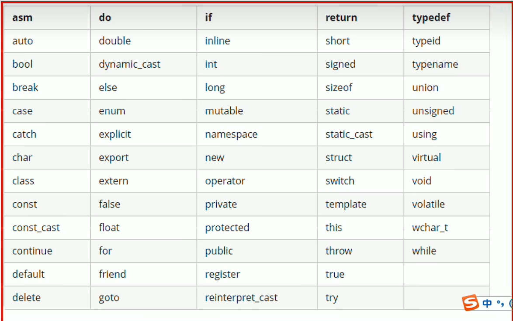
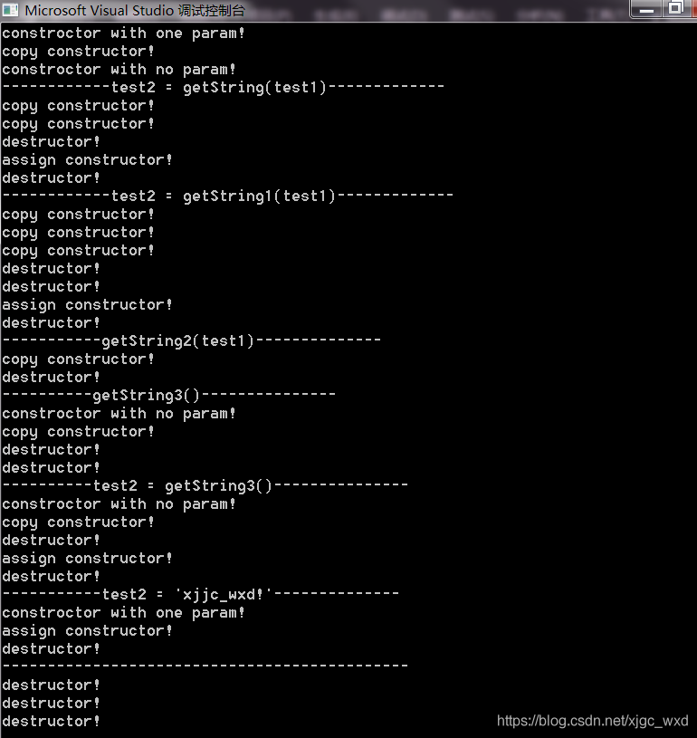
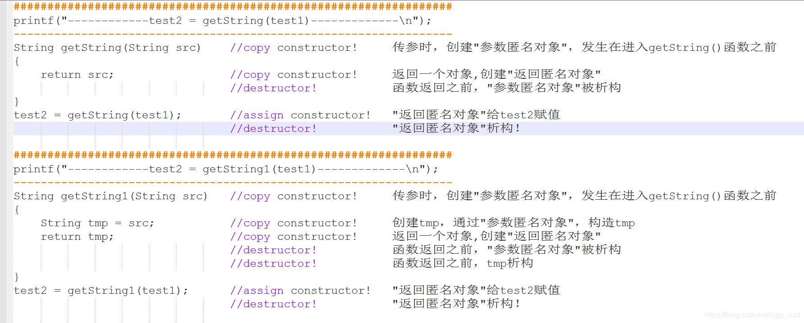
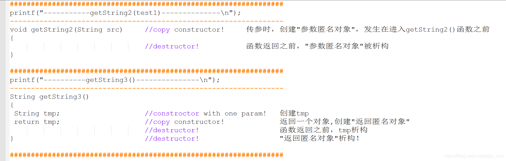
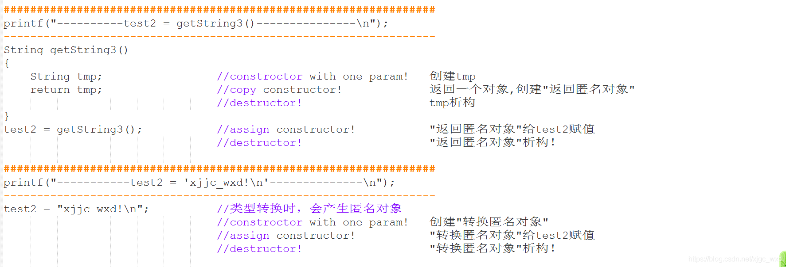

# C++ 黑马程序员课程总结

## 入门篇
### 1. 关于常量的定义
   * 宏常量： 写法为```define  week 7``` (无 “；”)，可以在数组中使用，是全局常量，此时week和常数7挂钩，不可改变
   * const修饰的变量： 写法为```const int week = 7;```，其本质是int类型的不可修改**变量**，不能在int[]初始化中使用

### 2. 关于头文件(.h)的声明和实现(.cpp)的关系

   * .h文件
     * 全局变量要声明是extern的形式：```extern int Num_h ;```而不要去初始化该变量，否则会引发重复定义问题。
     * 在全局变量前加入extern 的声明， 则意味着此变量的作用域不再局限于此(.h)和(.cpp)文件，即只要编译且链接的所有文件均可使用。这会导致各类重定向问题，作用域不明确问题（常常发生在不同文件但具有同名变量或函数的情况下）。
     * 函数则一般不用追加extern，不推荐，这会导致该函数及其同名函数成为该命名空间下的重写。

   * .cpp文件

     * 用于实现再.h文件中定义好的变量和函数。

     * 不要extern 函数，需要用的话就#include ，否则常常出现单方面修改函数原型的错误，例如函数里的类会出现不知道自己的作用域和定义在哪儿的情况。（**这个我也不懂**，就少用吧）


### 3. extern关键字【弄不懂啊  先算了】

   * 在extern 之后会自动在已经编译链接的文件中寻找该存储在全局区的该同名全局变量或全局函数

   * 用法：

     * **修饰全局变量**：在声明全局变量的时候使用extern修饰变量，表明该变量定义于其他翻译单元。

       ```c++
       //file1
       int i = 0; //默认拥有外部链接
       extern int j; //j定义于其他翻译单元
       extern int i = 10; //与 int i = 0 相同，这里extern被忽略，属于重复定义
       
       /*请注意，对于全局变量，如果语句中没有extern也没有显示赋值，编译器（在VS2017中实测）会帮忙初始化变量为0，这种情况会视为变量定义，但是却不会与之后的变量定义发生冲突，所以这么写是可以的*/
       //file1
       int i; //编译器会帮忙初始化0
       extern int i = 10; //第二次变量定义，但是这里却是允许的，变量变成了10
       ```

     * **修饰全局常量**：表明该全局常量拥有外部链接（可以被其他翻译单元发现），否则全局常量默认是只有内部链接，即不可被其他翻译单元发现。

       ```c++
       //file1
       extern const int J = 10; //定义拥有外部链接的全局常量J
       
       //file2
       extern const int J; //声明全局常量J来自于其他翻译单元
       ```

     * **修饰局部变量**：表明该局部变量在其他翻译单元中被定义，需要在链接的时候去解析。

       ```
       void Test()
       {
       	extern int i; //表明i来自于其他翻译单元
       	extern int j = 20; //错误，因为局部变量的生命周期在退出函数的时候就结束了，所以不允许其建立外部链接
       }
       ```

       

     * **修饰一个字符串**：形如extern “C” 之类的用法大家肯定见过了，表明后接的代码块（或者后接的声明）使用C语言调用惯例。C++ 是兼容C的，但是C对C++的支持就比较差，用C++的代码编写的库C又可能报错，就需要用```extern "C"```包括起来。

       ```c++
       //sum.cpp
       extern "C"
       {
           int Sum(int i, int j)
           {
               return i + j;
           }
       }
       ```

     * **修饰一个模板**：表明该模板已经在其他翻译单元实例化，不需要在这里实例化。

### 4. 声明和定义

* 定义 = 声明 + 初始化
     * ```int a = 5```意思是声明整型变量a，并初始化值为5；该类写法还有```int a(5)```等
     * ```int a;```其实编译器已经帮忙做好了初始化。
     * ```extern int a;```意思是声明该整形变量具有外部链接属性。只是声明。
     * ```extern int a = 5;```就是定义了，既包含了声明也包含了初始化

* 声明可以多次，但是定义只能有一次。

* 声明不分配储存空间

* 风格问题

     * 头文件不要做定义，容易导致重复定义
     * 尽量使用static将变量局限于源文件，除非设计之初就是全局性质变量。
     * 可以在头文件中声明一个变量，在用的时候包含这个头文件就声明了这个变量。

* 重定义问题

     ```c++
     int main(){
         // extern int a;// 报错，无法解析外部符号int a，因为a没在外部文件定义
         typedef int Int; // 声明int的另一种写法Int
         int a;
         //int a;// 重定义
         extern int a; // 声明
     }
     ```

* 任何在多文件中使用的变量都需要有与定义分离的声明。在这种情况下，一个文件含有变量的定义，使用该变量的其他文件则包含该变量的声明（而不是定义）。
* [(26条消息) c++声明 和 定义 的区别_liujun3512159的博客-CSDN博客_c++声明和定义的区别](https://blog.csdn.net/liujun3512159/article/details/125904386)

### 5. 转义字符


### 6. 算数 \ 赋值 \ 比较 \ 逻辑运算符

* 算数运算符

  * ```+ - * /```分别对应加减（正负号）乘除

  * 取余 % 只能在int之间，返回int

  * ++/-- 有前置后置的区别
    * 前置 先在自身计算再合并到外部进行计算，例如```int a(1); int s1 = ++a;```那么分别对应```s1 = 2,a= 2 ```
    * 后置 先计算外部（保持自己不变）后自加，例如```int a(1); int s1 = a++;```那么分别对应```s1 = 1,a= 2 ```


* 赋值运算符

  * 加减乘除和取余都可以和等号一起，和python类似。

* 比较运算符

  * ```
    a == b;//相等
    a != b;//不等
    a < b;//小于
    a <= b;//小于等于
    a > b;//大于
    a >= b;//大于等于
    ```

* 逻辑运算符

  * ```
    && //与
    || //或
    ！ //非
    ```


### 7. 程序的内存模型

* 代码区：存放函数的二进制代码，由操作系统来进行管理。【01代码】
* 全局区：存放全局变量、静态变量以及常量。(数据段(静态区)，常量区)【不包含局部常量，包含局部静态变量】
* 堆区：由工程师分配(new)和释放(delete)，若不释放，程序结束时由操作系统来回收。【new或者malloc在堆区生成的变量】

* 栈区：由编译器自动分配释放，存放着函数参数，局部变量等。

* **内存四区意义**？
  * **程序运行前的情况**。
    * 在程序编译之后，运行之前，生成了一个可执行的程序，未执行该程序前分为两个区域：
      1、代码区：
      存放CPU能够识别的机器指令。  --> 其实指的就是0101这种数据。
    * 代码区是共享的，共享的目的是对于频繁被执行的代码，只需要在内存中有一份代码即可。
      无论执行了多少次程序，都是使用同一份代码,减少一定的内存开销。
    * 代码区是只读的，使其只读的原因是防止程序意外地修改它的指令。
    * 2、全局区：
      全局变量与静态变量存放在此。
      全局区还包含常量区、字符串常量、其他常量(const修饰的变量)存放在此。
      该区域的数据在程序结束之后由操作系统来释放
  * **程序运行后的情况。**
    * 栈区：由编译器自动分配释放，存放函数的参数值，局部变量等。
      注意：不要返回局部变量的地址，栈区开辟的数据由编译器自动释放。
    * 堆区：由工程师分配和释放，若不释放，程序结束时就会由操作系统来回收。
      在C++中主要利用new在堆区开辟空间。

[(26条消息) c++内存分区_物の哀的博客-CSDN博客_c++内存分区](https://blog.csdn.net/m0_64837135/article/details/123540585)

### 8. 关键字

#### * 关键字表

#### * 常用关键字

* auto：自动推断变量的类型

* catch：在try中运行的全局变量结果会保存，try块内的

    ```c++
    int res = 0;
    try
    {
        int n = 0;
        res = 1;
        throw res;
        //一般情况下执行的语段，遇见throw value语句后，清除try中的局部变量
    }
    catch(int& res)
    {
        //在这儿 res = 1，且可被修改
        //try 中的n就丢掉了，这也是代码块的特性
    }
    catch() //可捕获除了int类型外的所有异常
    {
        //try中throw value 后，开始运行的语段
    }
    ```

* const 和 static 修饰符

    * static修饰变量分为两种，

      * 第一种是修饰局部变量，这个操作会将局部变量从栈中转移至静态储存区（作用域变成当前文件的全局）（**但不是全局变量**），如果返回了地址的话，之后还可以继续调用（再次调用该局部静态变量所在函数，不会重复生成该静态局部变量，也就是说地址是唯一的，只开辟1次空间，**就算不返回也不会消失**），若两个函数生成两个同名的static 变量，则只对其函数可见，再次调用同样不新开辟空间，但两个同名静态局部变量的地址不同，都存放于全局区。

        ```c++
          void f(int) {
            static int i = 0;
              cout << &i << " " << ++i << endl;
        }
        void f(double) {
            static int i = 0;
            cout << &i << " " << ++i << endl;
        }
        int main() {
            f(1);
            f(1.0);
            f(1);
            f(1.0);
            f(1);
        }
        //结果为
        0092C71C 1
        0092C720 1
        0092C71C 2
        0092C720 2
        0092C71C 3
        ```
      * 第二种是修饰全局变量，不会改变全局变量的作用域和生命周期，但是保证这个全局变量只能在当前的文件(.h .cpp)中使用，无法extern到别的文件，但是相应的，别的文件可以使用这个全局变量的名字。
      
      * 普通全局变量的作用域是全局范围，不限于某个文件，但需要extern或者包含该全局变量所在的头文件。
      
          ```c++
        static int s_qj = 10;
          int qj = 11;
        int* fun(int nn)
        {
            static int n = 100;
            n = nn;
            cout << "fun静态局部变量的地址为" << &n << endl;
            return &n;
        }
        int main()
        {	
            int jb = 5;
            static int s_jb = 6;
            cout << "全局变量的地址为" << &qj << endl;
              cout << "静态全局变量的地址为" << &s_qj << endl;
            cout << "局部变量的地址为" << &jb << endl;
              cout << "静态局部变量的地址为" << &s_jb << endl;
            fun(10);
            fun(11);
            cout << "fun静态局部变量的值还能调用，为" << *fun(12) << endl;
            system("pause");
            return 0;
        
        }
        ```
      
        结果为
      
        ```c++
        全局变量的地址为00B3303C
        静态全局变量的地址为00B33040
        局部变量的地址为00AFF81C
        静态局部变量的地址为00B33048
        fun静态局部变量的地址为00B33044
        fun静态局部变量的地址为00B33044
        fun静态局部变量的地址为00B33044
        fun静态局部变量的值还能调用，为12
        请按任意键继续. . .
        这里面有个有意思的事情，就是随着编译顺序，前后连续的生成了int地址，换成容器后就没有这种连续的现象了（没试。
        ```
      
    * static 在类中的作用也分两种
      
      * static作用于类内的成员变量，这会导致该变量不再单独属于某一个该类的实例，而是所有实例的共享参数，或者说是该类的全局成员变量。那么它有如下特点：
        * 1. 有this指针(静态成员函数没有)，不可以在构造函数内初始化，但可以在构造函数中调用，修改，本质是变量。只初始化一次，不会被销毁，可以一直调用。【之所以不在构造函数中初始化是因为，构造函数的发生是在静态成员变量之前】
          
          * 2. const static 成员变量是可以在类内初始化的，这是由于```static const int num = 5;```在c++中被看作了是一种常量声明式，也就是类似于**作用域为该类的宏定义**，所以可以在类内定义，算是语法糖（也可以在类外声明）。
          
          * 3. 静态数据成员可以成为成员函数的可选参数，⽽普通数据成员则不可以。
          
               ```c++
               class base{
               public :
               static int _staticVar;
               int _var;
               void foo1(int i=_staticVar);//正确,_staticVar为静态数据成员
               void foo2(int i=_var);//错误,_var为普通数据成员
               };
               ```
          
          * 4. 静态数据成员的类型可以是所属类的类型，⽽普通数据成员则不可以。普通数据成员的只能声明为所属类类型的指针或引⽤。
          
               ```c++
               class base{
               public :
               static base _object1;//正确，静态数据成员
               base _object2;//错误
               base *pObject;//正确，指针
               base &mObject;//正确，引⽤
               };
               ```
          
          * 5. 静态数据成员的值在const成员函数中可以被合法的改变， 增加了mutable的成员变量也可以被改变。
          
               const修饰成员函数放于函数后面（因为放前面属于是声明返回值是不可变的）
          
               ```c++
               class base{
               public:
               	base(){_i=0;_val=0;}
                   mutable int _i; //类数据成员加上mutable后，修饰为const的成员函数就可以修改它
               	static int _staticVal;
               	int _val;
               	void test() const{//const 成员函数
               		_i++;//正确，mutable数据成员
                 		_staticVal++;//正确，static数据成员
                		_val++;//错误
                	}
                };
               ```
          
          * 6. 静态成员变量可以是private属性，不存放于全局的数据空间，所以也不会和全局名字冲突。

        * static修饰成员函数同样会使成员函数上升到整个类的全局作用域（不是程序的），它有如下特点：

          * 1. 不含有this指针，所以里面不可以有this->val的操作，所以也无法使用成员变量，但是对静态成员变量依旧可以访问到。

          * 2. 不可以用const和static同时修饰成员函数

                C++编译器在实现const的成员函数的时候为了确保该函数不能修改类的实例的状态，会在函数中添加⼀个隐式的参数const this*。但当⼀个成员为static的时候，该函数是没有this指针的。也就是说此时const的⽤法和static是冲突的。

               我们也可以这样理解：两者的语意是⽭盾的。static的作⽤是表⽰该函数只作⽤在类型的静态变量上，与类的实例没有关系；⽽const的作⽤是确保函数不能修改类的实例的状态，与类型的静态变量没有关系。因此不能同时⽤它们。

      * const 修饰变量意味着将变量变为该类型常量(本质是变量，但不可变)，必须同时初始化，const紧跟一个变量名时修饰的的是这个变量的值，表示这个值不可修改。（c中const修饰具有外部链接属性，c++中默认没用外部链接属性）

        * ```c++
          int main()
          {
              const int a_c = 1; //a只读，不可修改
              a_c++;/不合法
              const char c = "a"[0];//"a"是一个char[2]的格式，同样只读
              int* p_int = &a_c;//报错，const int* 不可以初始化int*，char类型同样
              
              //常量指针：指向常量的指针，指针本身可移动
              int a = 1;
              int b = 2;
              const int* p_int = &a;//可以，int* 可以初始化const int* ，const修饰int，*p_int 不可修改
              int const * p_int = &a;//可以，效果等同
              cout << *p_int << endl;//输出1
              a = 5;
              cout << *p_int << endl;//输出5
              p_int = &b;//可以
              *p_int++;//不可以
              
              //指针常量：指针本身是常量，也就是指针固定指向的内存地址，不可变
              int * const p_int = &a;//可以，const修饰p_int, 则p_int的指向不可修改
              *p_int++; //可以
              p_int = &b;//报错
              
              //常量指针产量：指针指向的地址不可变，内容必须是常量
              const int a = 5;
              const int * const p_int = &a;//对p_int的任何修改都不对
              
              //与引用的区别，引用就是用指针来做的
              int a = 5;
              const int b = 5;
              int& b_ = b;//报错，类似于int * p 被const int 的数据地址初始化
              int & a_ = a;//a_ 是a的引用（别名），等同于int * const p = &a; a_ 和 *p 是一样的
              int & const a_ = a;//和上面一样的效果，类似于int * const const p = &a
              const int & a_ = a;//类似于const int * const p = &a; 也就是说*p不可变，也就是说a_不可变
              
              //敲黑板，这里有个语法糖！！！
              const int & a = 5;//这是合法的，其本质是做了一个匿名对象int temp = 5；const int a = temp;
              //这个形式也适用于在函数里修饰形参，用于接收常数比如自然数5等。
              
          }
          ```

      * const在函数中的作用

        * 修饰普通函数(const 在前)意味着该函数返回值应是const类型(不可为左值)，一般用const 修饰的变量来接收，但是编译器对很多类型做了优化，比如：

          * ```c++
            // int、char类型的接收是合法的,也就是在这个例子中，fun()前的const只起到fun()不为左值的作用
            const int fun()
            {
            	const int a = 5;
            	return a;//return 5；也合法
            }
            //函数左值的例子
            int& fun1()
            {
                static int a = 5;
                return a;
            }
            
            int main()
            {
                int a = fun();//合法
                const int b = fun();//合法
                cout << fun1() << endl;//输出5
               	fun1() = 10;
                cout << fun1() << endl;//输出10
            }
            ```

          * ```c++
            // const int * fun()的返回值必须是指针，且接收也必须为const int * 类型的指针变量
            const int * fun()
            {
                const int * res = new int(5);
                *res = 5;//不合法
                return res;
            }
            int main()
            {
                int* a = fun();//不合法
                const int* b = fun();//合法
            }
            ```

        * const在函数形参列表的作用

          * ```c++
            void fun00(const int &a)//a是一个引用，但在fun()里不可修改，const不会影响到函数外的数据
            {
                cout << a << endl;
            }
            void fun01(int &a)//a是一个引用，但在fun()里不可修改，const不会影响到函数外的数据
            {
                a = 50;
                cout << a << endl;
            }
            int main()
            {
                int a = 10;
                fun00(a);//输出10
                fun00(11);//输出11
                fun01(a);//输出50,main 函数里的 a 也变为50
                fun01(11);//报错
                
            }
            ```

      * const在类中的作用，如下：

        * 修饰成员变量，意味着该成员变量在初始化后不可改变。

        * 修饰成员函数，写法为```void fun() const {}``` ,必须在后面声明。常函数内部不可修改成员变量，但可以修改静态成员变量，在成员变量前加入```mutable int val;```则表示val可以在const修饰的成员函数内部修改。

        * 修饰类的实例化对象（常对象），在类前加类似于```const int a = 0;```的用法。常对象只能调用常函数。

          ```c++
          class base
          {
          pubilc:
              base():a(0), b(1),d(3){};
              int a;
              const int b;
              static int c;
              mutable int d;
              void fun1() const{}
          
              void fun2(){}
          
              static void fun3(){}
          
          }
          int base::c = 2;
          int main()
          {
              const base c_base;
              c_base.a = 5;//可执行
              c_base.b = 10;//报错，const修饰不可为左值
              c_base.c = 40;//可执行
              c_base.d = 60;//可执行
              c_base.fun1();//可执行，const对象可以调用const成员函数
              c_base.fun2();//报错，常对象不可以调用非常成员函数
              c_base.fun3();//可执行
          }
          ```

    * 参考资料

      * [C++静态变量,常量的存储位置你真的了解吗_C 语言_脚本之家 (jb51.net)](https://www.jb51.net/article/221165.htm)
      * [(26条消息) C++ static与const用法详解_子木呀的博客-CSDN博客_c++ const static](https://blog.csdn.net/qq_41687938/article/details/118160853)
      * [(25条消息) 【c++】static， const 修饰_Jason~shen的博客-CSDN博客](https://blog.csdn.net/qq_40602000/article/details/95989014)
      * [(25条消息) c++中const的作用_酸菜鱼的鱼的博客-CSDN博客_c++中const的作用](https://blog.csdn.net/u010299133/article/details/104355772)

* 基础数据类型
  * char
    * 占用一字节
    * 初始化方法有两种
      * ```char * char_p = "abc"```这类属于字符串常量，存放于常量区（char_p存放于栈区），不可修改。
      * ```char cha[] = "abc"```这类属于字符数组，存放于栈区，可修改。这两个例子的 cha 的size都是4。
      * 补充说明
        * ```char s = "a"[0]```，这类是字符变量，由于"a"被认为是const char[2]匿名类型，读取a这个字符需要自己取地址。
        * ```char s = 'a';```单引号是字符，双引号是字符串；字符串后面默认有一个结束符，所以字符串的大小是n+1。
        * ```char * p = new char[10]```这个属于开辟到堆区，需要手动释放。

  * int

    * long long int 占用8字节，short int 占用2字节， int 占用4字节，随系统变化

    * 初始化方法

      * ```int a = 5;int a(5);```都可以，代表一个int 变量

      * ```int a[5] = {1,2,3,4,5}```代表一个int数组

      * ```int a[] = {1,2,3,4,5}```代表一个int数组，自动推断长度为5

      * ```int a[5] = {1}```代表一个int数组，默认全部为1

      * ```int a[] = {}```，声明一个数组

      * 建议用auto来定义一个多维数组

        * 在堆上建立数组

          ```auto arr = new int[3][6]{1,2,3,4,5,6,7}```这是声明了一个在堆上建立的3行6列的数组，18个int变量的地址是连续的。按行连续。

        * 在栈上建立数组更好建立，但不易保存

          ```int arr[3][6] ```这相当于声明了一个具有三个指针的int数组，每个指针都指向一个具有6个int的数组头地址。

    * 数组名有两个作用，一是当作指针，是个地址，另一个是可以计算数组长度。

  * bool 

    * bool占用1字节
    * 初始化方法
      * ```bool a = NULL\ 0 \ false;```会被定义成0,其余都是初始化为1。
      * bool的初始化方法和int一致。

### 9. 宏命令

1. #ifndef 命令: 防止重复定义

   ```C++
   //编写头文件test.h时，在头文件开头写上两行，如下：
   #ifndef __TEST_H
   #define __TEST_H
   "
   ...... #内容
   ......
   "
   头文件结尾写上一行：
   #endif
   ```

2. ```# define week 7```： 见到week 就相当于 7

### 10. 匿名对象

* 定义：没有名字的对象
* 通常以下三种情况会产生匿名对象：
   1.以值的方式给函数传参,会产生临时对象，为方便区分，称为"参数匿名对象"；
*  2.函数需要返回一个对象时，会产生临时对象，为方便区分，称为"返回匿名对象"
   3.[类型转换](https://so.csdn.net/so/search?q=类型转换&spm=1001.2101.3001.7020)时，会产生临时对象，为方便区分，称为"转换匿名对象"；
* 生命周期
  * [(26条消息) C++匿名对象_xudong.wang的博客-CSDN博客_c++匿名对象](https://blog.csdn.net/xjgc_wxd/article/details/105177557)

### 11.深浅拷贝

* 浅拷贝，简单赋值拷贝操作（尤其注意对指针的拷贝）
* 深拷贝，在堆区重新申请空间，进行完全拷贝
* 深浅拷贝主要是针对涉及指针的拷贝，以及在堆区开辟空间的重复释放问题。

### 12. 文件操作

需要包含头文件```<fstream>```

该头文件下包含三大类：

* ofstream： 写操作
* ifstream：  读操作
* fstream :     读写操作

#### 一、 文本文件

##### 1. 写文件

```c++
#include<fstream>

int main()
{
    ofstream ofs;
    ofs.open("/test.txt", 打开方式);
    /* 打开方式有： ios::in 只读
    			  ios::out 只写 
    			  ios::ate 初始位置文件尾 
    			  ios::app 追加方式写 
    			  ios::trunc 删除原文件再创建 
    			  ios::binary 二进制方式
        多个同用时用|号相连                   */
    if(ofs.is_open()) //判断是否打开成功
    {
        ofs<<"data"<<endl;
    	ofs.close();
    }
    else{cout<<"打开失败"<<endl;}  
}
```

##### 2. 读文件

```c++
#include<fstream>

int main()
{
    ifstream ifs;
    ifs.open("/test.txt", 打开方式);
    /* 打开方式有： ios::in 只读
    			  ios::out 只写 
    			  ios::ate 初始位置文件尾 
    			  ios::app 追加方式写 
    			  ios::trunc 删除原文件再创建 
    			  ios::binary 二进制方式
        多个同用时用|号相连                   */
    if(ofs.is_open()) //判断是否打开成功
    {
        // 方式一
        char buf[1024] = {0};
        while (ifs >> buf)// 按行读，其中buf代表一个const char* 地址，ifs会在这个地址第一个位置开始覆盖原来的数据，每行                           // 最后会输进去一个'/0'结束符,所以理论上只需要让buf大于这个文件的每一行字符的最大值加1就可以了。
            		      // 这里要强调，'\n'字符是不会读进去的，因为按理讲，每一行都有'\n'，注意 string 类型是不可以的
        {
            cout << buf << endl;
        }
        
        // 方式二
        char buf[1024] = {0};
        while( ifs.getline( buf, sizeof(1024) ) )// 按行读，同上
        {
            cout<<buf<<endl;
        }
        
        // 方式三
        string buf;
        while ( getline(ifs, buf) )//全局函数的读取
        {
            cout<<buf<<endl;
        }
        
        // 方式四
        char c;
        while ((c = ifs.get() ) != EOF )// 按字符读，包括'\n'也会被读到 EOF = end of file
        {
            cout<<c;
        }
    }
    else{cout<<"打开失败"<<endl;}  
}
```

####  二. 二进制读写

* 与文本问价的区别是要加 ios::binary 操作符。

* 写文件

  * 二进制写主要利用流对象调用成员函数write

  * 函数原型： ```ostream& write(const char* buffer, int len);```

  * 参数解释：字符指针buffer指向已开辟内存的一段空间。len 是读写的最大字符数（超过了会停止）。

    ```c++
    person p;
    	fstream ofs;
    	ofs.open("test.txt", ios::trunc | ios::out | ios::binary | ios::in );
    	if (ofs.is_open())
    	{
            ofs << (const char *) & p;//这个也是可以的，但是读进去的东西和下面的不一样,谨慎使用吧
    		ofs.write((const char*)&p, sizeof(person));// 要强转为const char *的类型，还要给出person类型的大小
    	}
    	ofs.close();
    ```

    

* 读文件

  * 二进制读主要用流对象的成员函数read

  * 函数原型：```ostream& read(char* buffer, int len);```

  * 参数解释：字符指针buffer指向内存的一段储存空间，len是读写字节数。

  * 实例：

    ```c++
    person p;
    	person pp;
    	p.age = 10;
    	fstream ofs;
    	ofs.open("test.txt", ios::trunc | ios::out | ios::binary | ios::in );
    	if (ofs.is_open())
    	{
    		ofs << (const char *) & p;
    		//ofs.write((const char*)&p, sizeof(person));// 这两种写方式都可以正常读出来
    	}
    	//ofs >> (char*)&pp;// 这种读方式读出来的不对
    	ofs.read((char*)&pp, sizeof(p));
    	cout << pp.age << endl;
    	ofs.close();
    ```

## 核心篇

### 引用

1. 引用的本质是指针。

   ```c++
   int a = 1;//比如&a = 0x2630001
   int & a_= a; //则a_就被认为是a的别名,同样 &a_ = 0x2630001
   // 用指针来理解引用
   // 引用相当于是一个int * const a__的指针，是一个指针常量，在编译器看来，输入a_ 和 输入*a__是没有什么区别的
   // 用这个观点来看， 很多引用的问题就可以转接为用指针来理解。
   ```

2. 问题一： 声明引用一定要初始化是为什么？初始化后不可以改变的原因是什么？

   * 和声明const int a 一样，不初始化以后就没有机会改变其值了。

   * 引用不可改变的是引用指向的地址，而非该地址下的值。

     ```c++
     int a = 1;
     int& a_ = a;//引用初始化，初始化的是指向
     a_ = 3;//这是合法的，这就是修改值
     int b = 2;
     a_ = b;//这也是合法的，但是是将b的值传递给a(a_)，不是修改a_的地址
     ```

3. 问题二：引用做函数参数和函数返回值，其要求的传入参数和输出参数类型都是什么？

   ```c++
   int& print(int & a )
   {
       cout << a << endl;
       return a;
   }
   
   int print01(int& a )
   {
       // 返回的是值，不存在地址这个说法，所以不能用&print(a)这种写法，类似于没有&1这种写法
       // 但是函数地址是可以访问的，有int (*p)(int & a) = print;这种写法相当于给print取了个别名
       return a;
   }
   
   
   int main()
   {
       int a = 1;
       int a_ = a;
       {
           int b = print(a);//合法，就像int b = a_;一样 属于传值。a和b的地址不同
       	int & b_ = print(a); //合法，int& 返回的引用用引用来接收，属于地址传递，b_属于a的别名。
       	print(a) = 5;//也合法
       }
       {
           
       	int b = print01(a);//合法，相当于初始化b的值为a的值
           int & b_ = print01(a);//不合法，相当于int & b_ = 1;
           print01(a) = 5;// 同样不合法，相当于1 = 5;
       }
       
   }
   ```

4. 问题三：为什么不要返回一个局部变量的引用？

   * 局部变量生命周期比较短，容易造成访问错误。

     ```c++
     int & test()
     {
         int a = 1;
         return a;
     }
     int main()
     {
         int & ref = test();//可以编译，但是不能重复使用ref
         cout << ref << endl;//输出1，编译器自动保留一次
         cout << ref << endl;//ref所指向的内存已经释放，输出909127390乱码
         return 0;
     }
     ```

5. 问题四： 常数的引用原理是什么？

   * 本身常数被引用就不合法，但是编译器自动做了一些处理，使得某些常数的引用合理的合法化。

     ```c++
     // 1. 函数的形参引用常数的问题
     void test01(int& a)
     {
         
     }
     // 2. 函数的形参引用常数的问题 -> 方法 
     void test01(const int& a)
     {
         
     }
     int main()
     {
         {
             int a = 1;
         	test01(a);//不报错，合法使用
         	test01(1);// 报错，相当于是int &a = 1;这里1的值显然是不可能变的，1就是1，这里的1看作是个const int
             	      // 那么int * const a = &1;就不礼貌了。
         }
         {
             int a = 1;
         	test01(a);//不报错，合法使用
         	test01(1);// 不报错，相当于是const int &a = 1;类似于 const int temp = 1; const int & a = temp;
             	      // 那么const int * const a = 1;也算是合理，编译器进行处理就可以使用了。
         }
     }
     ```

     

### 函数

1. 函数的构成

   * 由返回值类型 函数名 形参 和 函数主体构成。

     ```c++
     int sum(int a, int b)
     {
     	return a+b;
     }
     ```

   * 函数类型分为有参有反、有参无返、无参有反、无参无返四种，主要区别在于是否有形参、是否有返回值。

     ```c++
     //无参无返
     void fun()
     {
         system("pause"); 
     }
     //无参有返
     int fun()
     {
         return 0;
     }
     //有参无返
     void fun(int a)
     {
         cout<< a <<endl;
     }
     //有参有反
     int fun(int a)
     {
         return a;//传值
     }
     ```

   * 函数的形参可以有默认值

     ```c++
     void fun(int a = 1)
     {
         cout<<a<<endl;
     }
     int main()
     {
         fun(2);//打印2
         fun();//打印1
     }// 需要注意，从第一个形参有默认值之后的形参，必须有默认值
     ```

   * 函数也有其存放的地址

     ```c++
     int fun(int = 1){}
     int main()
     {
         cout << fun << endl;//
     	cout << &fun << endl;//两个输出的值是一样的，这里类似于int a[],本身数组名a的值就是数组的头地址
         cout << sizeof(fun) << endl;//报错，sizeof不支持对函数操作
         cout << sizeof(&fun) << endl; //合法，结果是4
         
         //既然有地址，当然可以用指针指向其，也可以做引用
         // 指针
         int (*p)(int) = fun;//但是不可有默认值，使用p代替fun时也不可省去默认值
         // 引用
         int (&p)(int) = fun;//同上
     }
     ```

     

   * 函数有重载的特性

     1. 函数重载的作用

        * 是，提高代码的复用性，即同一函数名，形参和函数主体内容不同，根据形参自动执行不同代码

     2. 函数重载的语法和条件

        ```c++
        // 条件 1. 在同一作用域下（否则用不上重载技术）
        // 条件 2. 函数名称相同
        // 条件 3. 函数的参数类型或参数个数不同(满足其一即可)
        namespace myfun
        {
            void test()
            {
                
            }
            void test(int a)
            {
                
            }
            void test(float a)
            {
                
            }
            void test(int a, int b)
            {
                
            }
        }
        ```

     3. 函数重载注意事项

        1.  函数返回值不同不算重载的条件

        2.  参数的占位符也计入参数个数，可以形成重载

        3.  参数个数不同作为唯一条件的重载，要谨慎使用默认值，可能会造成有多 重载函数 "test" 实例与参数列表匹配的问题

           ```c++
           void test(int a){}
           void test(int a, int = 1){}
           //虽然明面上构成了重载，但是当调用
           test(1); //时，就会出现问题
           ```

        4. 引用作为函数的参数且达成了重载时，容易出现混淆的问题，但编译不会出现问题

           ```c++
           void test(int &a ){cout<<"int & "<<endl;}
           void test(const int& a){cout<<"const int & "<<endl;}
           int main()
           {
               int a =1;
               const int b = 2;
               test(a);// 打印int & 
               test(1);// 打印const int & 
               test(b);// 打印const int &
           }
           ```

           

   * 函数的占位符

     * 作用一：提高代码健壮性
     * 作用二：可用于函数重载条件
     * 作用三：可用于++或--运算符重载（在类里着重讲）

### 结构体

* **C++中的结构体和类唯一区别就是，结构体的默认成员公有(Public)，类默认为私有(Private)。** 

* 与c语言做一些区分
  * C++中，不使用结构体丝毫不会影响程序的表达能力。C++之所以要引入结构体，是为了保持和C程序的兼容性。
  * 在C++中使用结构体，是因为，可以使用结构体将不同类型数据组成整体，方便于保存数据。（若用类来保存，因类中成员默认为私有，还要为每个数据成员特定函数来读取和改写各个属性，比较麻烦。）
  * C语言中结构体不允许定义函数成员，且没有访问控制属性的概念。C++为C语言中的结构体引入了成员函数、访问控制权限、继承、包含多态等面向对象特性。C++在struct之外引入了class关键字，但为了保持与C程序的兼容，C++保留了struct关键字，并规定结构体默认访问控制权限为公有类型。
  * C语言中，空结构体的大小为0，而C++中空结构体（属于空类）的大小为1。
  * C++中空类的大小为1的原因：空类也可以实例化，类实例化出的每个对象都需要有不同的内存地址，为使每个对象在内存中的地址不同，所以在类中会加入一个隐含的字节。
  * [C++中结构体和类的区别 - Carrie_0173 - 博客园 (cnblogs.com)](https://www.cnblogs.com/Carrie-0173/p/6357715.html)
* 关于结构体就不再细述，直接看类。

### 类

#### 封装

* 意义：将属性和行为集合起来，并加以权限控制。

* 语法：

  ```c++
  class class_example
  {
  public:// 类内可以访问，子类可以访问，友元可以访问，对象可以访问
      int num1;
      const int num2; //常量, 在构造函数内初始化后不可修改
      static int num3;// 静态成员变量，属于类本身的属性，不属于某个对象，但是有this指针，类内声明，类外初始化
      mutable int num4;// 可变成员变量，在const修饰的成员函数内仍可修改
      int * p = new int[4];// 指针成员变量，需要在析构函数内delete
      
      void fun1() const// 常成员函数，意思是该对象的成员变量在此函数内不变
      {
          num1++;//报错，不可改变
          num2++;//报错，函数和本身均要求不可变
          num3++;//通过，静态成员变量不属于某个对象
          num4++;//通过，mutable修饰的成员变量可以在const修饰的成员函数内修改
      }
      
      static void fun2()//静态成员函数，属于类本身,内部没有this指针，故可调用静态成员变量，
          			  //不可与const同用，因为const在类内部实现用到了this指针
      {
          
      }
      
      class_example(): num1(1), num2(2), num4(4),num(5),num(6)
      {
          
      }//构造函数，无参方式
      class_example(int): num1(1), num2(2), num4(4),num(5),num(6)
      {
          
      }//构造函数，有参方式
      class_example( class_example other_class): num1(1), num2(2), num4(4),num(5),num(6)
      {
          
      }//构造函数，拷贝方式
      ~class_example()
      {
          delete [] p;
      }//析构函数
      
  protected:// 类内可以访问，子类可以访问，友元可以访问，对象不可访问，外部不可访问
      int num5;
  private:// 类内可以访问，友元可以访问，子类不可访问，对象不可访问，外部不可访问
      int num6;
  };
  ```

* 构造函数和析构函数

  * 构造函数
    1. 构造函数没有返回值，也不写void
    2. 函数名称和类名一致
    3. 构造函数可以有参数，故可以重载
    4. 程序在调用生成对象时会自动调用函数且只调用一次

  * 析构函数

    1. 析构函数，没有返回值也不写void
    2. 函数名称和类名一致，但需要在前面加~
    3. 析构函数没有参数，所以不会发生重载
    4. 程序在对象销毁时会自动调用析构函数，无需手动调用，且只调用一次

  * 构造函数调用方式

    ```c++
    class person
    {
    public:
        int age;
        person():age(2){cout << "无参构造"<<endl;}//无参构造
        person(int a)age(a){cout << "有参构造" << endl;}//有参构造
        person(cosnt person& a)
        {
            this->age = a.age;
            cout << "拷贝构造" <<endl; 
        }
        person& operator=(const person & temp)// person类赋值重载，系统默认给好了
        {
            if(this == & temp){return *this;}
            else {this->age = temp.age; return this;}
        }
        
    }
    
    void test()
    {
        // 声明后面的等于号相当于开始初始化
        person b;
        // 括号法
        {person a();}// 这是错的，这相当于声明函数
        {person a;}// 括号法的无参构造
        {person a(1);}// 括号法的有参构造
        {person a(b);}// 括号法的拷贝构造函数
        // 显式法
        {person a;}//无参构造
        {person a = person(10);}//显式法，有参构造，这里person(10)匿名对象，匿名对象做右值，左值相当于取名；
        {person a = person(b);}// 显示法、拷贝构造
        // 隐式转换法
        {person a = b;}// 隐式转换法、拷贝构造
        {perosn a = 10;}//隐式转化法，有参构造
        
        // 不能用括号法，来调用拷贝构造函数生成一个匿名对象
        {person (b);}// 错的，编译器认为person (b) === person b;重定义错误
    }
    
    int main()
    {
        test();
    }
    ```

  * 拷贝构造函数的调用时机(与匿名对象的机制大幅度重叠)

    * 使用一个已经创建完毕的对象来初始化一个新对象

    * 以值传递的方式给函数参数传值（传对象）

    * 以值的方式来返回局部对象

      ```c++
      #include <stdio.h>
      #include <string>
      #include <iostream>
       // 基础面试中常遇到的：实现String类的四个默认函数
      class String
      {
      public:
          int length() const
          {
              return len_;
          }
      public:
          String()
          {
              printf("constroctor with no param!\n");
              str_ = new char['\0'];
              len_ = 0;
          }
          String(const char *srcChar)
          {
              printf("constroctor with one param!\n");
              if (srcChar == nullptr)
              {
                  str_ = new char['\0'];
                  len_ = 0;
              }
              else
              {
                  len_ = strlen(srcChar);
                  str_ = new char[len_+1];
                  memcpy(str_, srcChar, len_);
                  str_[len_] = '\0';
              }
          }
          ~String()
          {
              printf("destructor!\n");
              if (str_ != nullptr)
              {
                  delete str_;
              }              
              str_ = nullptr;
              len_ = 0;
          }
          String(const String& srcString)
          {
              printf("copy constructor!\n");
              len_ = srcString.length();
              str_ = new char[len_ + 1];
              str_[len_] = '\0';
              memcpy(str_,srcString.str_,len_);
          }
          String& operator=(const String& srcString)
          {
              printf("assign constructor!\n");
              if (&srcString == this)
              {
                  return *this;
              }
              else
              {
                  if (str_!=nullptr)
                  {
                      delete str_;
                      str_ = nullptr;
                  }
                  len_ = srcString.length();
                  str_ = new char[len_ + 1];
                  str_[len_] = '\0';
                  memcpy(str_, srcString.str_, len_);
                  return *this;
              }
          }
       
      private:
          char* str_ = nullptr;
          int len_ = 0;
      };
       
       
      String getString(String src)// 值传递 调用拷贝构造创建 参数匿名对象src
      {
      	return src; // return 值，调用拷贝构造创建 返回匿名对象temp
          // src参数匿名对象被析构
      }
       
      String getString1(String src)// 值传递 调用拷贝构造创建 参数匿名对象src
      {
      	String tmp = src; // 拷贝构造 创建对象tmp
      	return tmp; // 拷贝构造， 使用tmp创建返回匿名对象temp
          // tmp析构
      }
       
      void getString2(String src)// 值传递 调用拷贝构造创建 参数匿名对象src
      {
      }// 函数返回前，参数匿名对象src被析构
       
      String getString3()
      {
       String tmp; // 无参构造 创建 tmp
       return tmp; // 拷贝构造 使用tmp创建返回匿名对象temp
          // tmp析构
      }
       
       
      int main()
      {
          String test("abcdefg");// 有参构造
          String test1 = test;// 拷贝构造
          String test2; // 无参构造
       
          printf("------------test2 = getString(test1)-------------\n");
          test2 = getString(test1);// 返回匿名对象temp给test2 赋值，然后temp析构
       
          printf("------------test2 = getString1(test1)-------------\n");
          test2 = getString1(test1);// 返回匿名对象temp给test2 赋值，然后temp析构
       
          printf("-----------getString2(test1)--------------\n");
          getString2(test1);// 
       
          printf("----------getString3()---------------\n");
          getString3(); // temp 返回匿名对象析构
       
          printf("----------test2 = getString3()---------------\n");
          test2 = getString3();// 返回匿名对象temp给test2 赋值，然后temp析构
       
          printf("-----------test2 = 'xjjc_wxd!\n'--------------\n");
          test2 = "xjjc_wxd!\n";// 显式有参构造
          return 0;
      }
      ```

      

      

      

      

* 构造函数的调用规则

  * 默认情况下，C++编译器一般给类添加三个构造函数
    * 默认构造函数(无参，函数体为空)
    * 默认拷贝函数(参数为本类对象，对属性进行拷贝)
    * 默认析构函数(无参，函数体为空)

  * 规则：
    * 用户定义有参构造，则编译器不再提供无参构造，但有拷贝构造
    * 用户自定义拷贝构造函数，则编译器不再提供其他构造函数

* 类对象作为类成员的构造和析构顺序

  先调用p2()的构造列表进行初始化，未定义的编译器自动调用无参构造函数，构造列表执行完毕后在调用p2()的函数体内部代码。

  ```C++
  class p1
  {
  public:
      int a;
      p1()
      {
          this->a = 10;
          cout << "p1无参构造函数，地址是"<<this << endl;
      }
      p1(int a)
      {
          this->a = a;
          cout << "p1有参调用，地址是" << this << endl;
      }
      ~p1()
      {
          cout << "p1析构，地址是" << this << endl;
      }
  };
  class p2
  {
  public:
      p1 p;
      p1* ptr = nullptr;
      p2()
      {
          if (ptr == nullptr)
          {
              ptr = &p;
          }
          cout << "现在的p属性地址："<< &this->p << endl;
          cout << "现在的p属性值为"<< this->p.a << endl;
          this->p = p1(2);
          cout << "p2构造函数" << endl;
          cout << "现在的p属性地址：" << &this->p << endl;
          cout << "现在的p属性值为" << this->p.a << endl;
      }
      ~p2()
      {
          cout <<"p2析构，地址是"<<this << endl;
      }
  };
  void test()
  {
      p2 p;
  }
  int main()
  {
      test();
      
  	system("pause");
  	return 0;
  }
  
  // 结果
  p1无参构造函数，地址是00CFFD0C
  现在的p属性地址：00CFFD0C
  现在的p属性值为10
  p1有参调用，地址是00CFFB54
  p1析构，地址是00CFFB54
  p2构造函数
  现在的p属性地址：00CFFD0C
  现在的p属性值为2
  p2析构，地址是00CFFD0C
  p1析构，地址是00CFFD0C
  请按任意键继续. . .
  ```

* 友元

  * 作用：提供权限，让友元类、函数（全局函数、成员函数）访问用该类的保护以及私有属性和方法。

  * 示例（Gay_f 和 building的顺序是锁死的 几乎没有别的可能，除非分文件编写）参考[(26条消息) 【C++】错误C2027:使用了未定义类型错误原因 两个类之间怎么相互使用成员 向前声明概念_列队猫的博客-CSDN博客_使用了未定义类型](https://blog.csdn.net/qq_43915356/article/details/107577450?utm_medium=distribute.pc_relevant.none-task-blog-BlogCommendFromMachineLearnPai2-1.compare&depth_1-utm_source=distribute.pc_relevant.none-task-blog-BlogCommendFromMachineLearnPai2-1.compare)

    ```C++
    #include<iostream>
    #include<string>
    using namespace std;
    
    class buliding;
    class Gay_f
    {
    public:
    	buliding* b; //在buliding定义之前，也就是只有声明时，不可实例化，只能引用或指针
    	Gay_f();
    	void visit1();
    };
    class buliding
    {
    	friend void goodGay(buliding& b);//全局函数做友元
    	friend class Gay;// 类做友元
    	friend void Gay_f::visit1();//类的成员函数做友元，要求类的成员函数声明在类之前，不然不知道你是友元。
    public:
    	buliding(): m_BedRoom("卧室"),  m_WC("厕所"), m_SittingRoom("客厅") {}
    
    	string m_SittingRoom;
    protected:
    	string m_WC;
    	void print1()
    	{
    		cout << "受保护的函数调用" << endl;
    	}
    private:
    	string m_BedRoom;
    	void print2()
    	{
    		cout << "私有的函数调用" << endl;
    	}
    };
    Gay_f::Gay_f()
    {
    	b = new buliding();
    }
    void Gay_f::visit1()
    {
    	cout << b->m_SittingRoom << endl;
    	cout << b->m_BedRoom << endl;
    	cout << b->m_WC << endl;
    	b->print1();
    	b->print2();
    }
    
    class Gay
    {
    public:
    	Gay()
    	{
    
    	}
    	buliding b;
    	void visit()
    	{
    		cout << b.m_SittingRoom << endl;
    		cout << b.m_BedRoom << endl;
    		cout << b.m_WC << endl;
    		b.print1();
    		b.print2();
    	}
    };
    void goodGay(buliding & b)
    {
    	cout << b.m_SittingRoom << endl;
    	cout << b.m_BedRoom << endl;
    	cout << b.m_WC << endl;
    	b.print1();
    	b.print2();
    }
    
    void test()
    {
    	buliding b;
    	goodGay(b);
    
    	Gay G;
    	G.visit();
    
    	Gay_f GG;
    	GG.visit1();
    
    }
    int main()
    {
        test();
    	system("pause");
    
    	return 0;
    }
    // 结果
    客厅
    卧室
    厕所
    受保护的函数调用
    私有的函数调用
    客厅
    卧室
    厕所
    受保护的函数调用
    私有的函数调用
    客厅
    卧室
    厕所
    受保护的函数调用
    私有的函数调用
    请按任意键继续. . .
    ```

* 运算符重载

  * 运算符重载：本质是一个成员函数，所以必须要针对class去定义，好处是方便使用,可以自定义类型使用运算符。

  * c++默认给了一个浅拷贝 拷贝函数(operator=(void))。

  * 格式[C++中返回引用和返回值的区别 - 青儿哥哥 - 博客园 (cnblogs.com)](https://www.cnblogs.com/qingergege/p/10486111.html)

    ```C++
    class Num
    {
        friend Num operator+(const Num & a,const Num& b);
        friend ostream& operator<<(ostream& out, const Num& temp);
        friend Num& operator++( Num& a);
        friend Num& operator++( Num& a, int);
    public:  
        Num(int nn):n(nn)
        {
            cout << this << "\t value = " << this->n << endl;
        }
        Num() : n(5)
        {
            cout << this << "\t value = " << this->n << endl;
        }
        
        // operator = ,只能在类内重载
        Num& operator=(const Num& temp)//两个Num类之间的=运算符运算，可以重载
        {
            if(this == &temp)
            {
                return *this;
            }
            else{
                this->n = temp.n;
                return *this;
            }
        }
        Num& operator=(const int& temp)//Num 和 int以及常数 的=预算符重载
        {
            this->n = temp;
            return *this;
        }
        
        // operator +, 可以在类内，也可以在类外,减法同理不再写
        Num operator+(const Num& b)// 两个对象之间的加法重载
        {
            return Num(this->n+b.n);
        }
        
        // 如果一定要把<<写在类内，那可以，就是用的时候不方便
        ostream& operator<<(ostream& out)
        {
            out << this->n;
            return out;
        }// 得这么用 m << cout << endl;
        
        // 实现++ ，分为前++ 后++
        // 前++的意思是先计算自己，再返回计算别的部分，返回值是自己
        Num& operator++()//不带占位符int 表示前缀
        {
            this->n++;
            return *this;
        }
        Num& operator++(int)// 表示后缀，后缀++是返回原来的自己，然后再++，我们可以这样实现
        {
            
            Num temp = Num(this->n);
            this->n++;
            return temp;
        }
        
        // 仿函数，()运算符重载
        void operator()(const char* temp)
        {
            cout << temp << endl; 
        }// 仿函数使用时如下{Num n;
    //					  const char* temp = "ahjkfhjkla"; or const char temp[] = "aljdjlka";
    //					  n(temp);	}就会打印temp的字符了。temp的第一种写法是常量字符串，第二种是常量字符
        
        int n = 0;
    };
    
    //***********************************************************************************************
    //***********************************************************************************************
    
    // 类外实现operator+ ，若访问私有成员变量，可以用友元
    Num operator+(const Num & a,const Num& b)
    {
        return Num(a.n+b.n);
    }
    
    // 类外实现<<运算符
    // 输出流对象是ostream,结构式ostream << 内容;所以自己编写的输出流最好也是返回一个ostream对象，这样就可以连续输出
    ostream& operator<<(ostream& out, const Num& temp)//这里不可以加const ostream，ostream实现里没有这个
    {
        out<< temp.n;
        return out;
    }
    
    //类外实现++运算符
    Num& operator++( Num& a)// 前置++
    {
        a.n++;
        return a;
    }
    
    Num& operator++(Num& a, int)// 后置++
    {
        Num temp(a.n);
        a.n++;
        return temp;
    }
    
    void test()
    {
        Num n;
        Num m;
        m.n = 3;
        
        n = m;
        cout << &n << "\t value = " << n.n << endl;
        n = 6;
        cout << &n << "\t value = " << n.n << endl;
    }// 这样就可以给一个Num的类型做=操作，如果不自己定义=操作的话，编译器给出一个浅拷贝版本，这使得n = m还可以做，但n = 6就会报错。
    // 类似的== ++ -- * << / 等都可以自己重定义。（operator= 必须是成员函数）
    ```

    * ⼀元操作符可以是不带参数的成员函数或带⼀个参数的⾮成员函数。
    * ⼆元操作符可以是带⼀个参数的成员函数或带两个参数的⾮成员函数。
    * operator=、operator[]、operator()、operator->只能定义为成员函数。
    * operator->的返回值必须是⼀个指针或能使⽤->的对象。
    * 重载 operator++ 和 operator--时带⼀个 int 参数表⽰后缀，不带参数表⽰前缀。
    * 除 operator new 和 operator delete 外，重载的操作符参数中⾄少要有⼀个⾮内建数据类型。
    * 重载的的操作符应尽量模拟操作符对内建类型的⾏为。

#### 继承

##### 继承的基本介绍

* 继承的好处： 减少代码量

* 继承的语法格式

  ```c++
  // 语法： class 子类 ： 继承方式 父类
  class A
  {
  
  }
  class B: public A
  {
  
  };
  ```

* 叫法

  A称为B的父类、基类

  B称为A的子类、派生类

* 派生类的成员
  * 包含父类继承过来的成员变量、函数等（需要按照权限来继承。
  * 自己本身所定义的成员变量和成员函数。
  * 父类的私有成员不会被子类继承（但可被友元访问

##### 继承方式

* 公共继承

  * 语法： ```class a : public b {};```
  * 将父类的public 和 protected 成员全部按照本身的权限继承下来

* 保护继承

  * 语法： ```class a : protected b {};```
  * 将父类的public 和 protected 成员全部按照保护权限继承下来

* 私有继承

  * 语法： ```class a : private b {};```
  * 将父类的public 和 protected 成员全部按照私有权限继承下来

  

##### 继承中的对象模型

* 主要问题是父类继承到子类的东西都有哪些？私有成员也继承了吗？

  * 全部都会继承下去(除了静态成员变量)，但是父类的私有成员会被编译器隐藏（加权限）

* 演示

  ```c++
  #include<iostream>
  #include<string>
  using namespace std;
  
  class base
  {
  public:
  	base() {}
  	int base_pub;
  	static int base_static_pub;
  	static void base_static_pub_fun() {};
  	void base_pub_fun() {}
  	~base(){}
  protected:
  	int base_pro;
  	static int base_static_pro;
  	void base_pro_fun() {}
  private:
  	int base_pri;
  	static int base_static_pri;
  	void base_pri_fun() {}
  	static void base_static_pri_fun() {};
  };
  
  class son: public base
  {
  public:
  	son() {}
  	int son_pub;
  
  	~son() {}
  protected:
  	int son_pro;
  	static int son_static_pro;
  	void son_pro_fun() {}
  private:
  	int base_pri;// 故意搞个同名的
  	static int base_static_pri;
  	void base_pri_fun() {} // 故意搞个同名的
  };
  
  void test()
  {
  	base b;
  	son s;
  }
  int main()
  {
      test();
  	system("pause");
  
  	return 0;
  }
  
  ```

  搞一手vs的分析工具 《Developer Command Prompt for VS 2022》

  输入命令```cl /d1 reportSingleClassLayoutson "main.cpp"```这里Layout后面是类名，”“里面是文件名

  结果如下

  ```powershell
  D:\Data_structure\Data_structure\c++\test>cl /d1 reportSingleClassLayoutson "main.cpp"
  用于 x86 的 Microsoft (R) C/C++ 优化编译器 19.33.31630 版
  版权所有(C) Microsoft Corporation。保留所有权利。
  
  main.cpp
  
  class son       size(24):
          +---
   0      | +--- (base class base)
   0      | | base_pub
   4      | | base_pro
   8      | | base_pri
          | +---
  12      | son_pub
  16      | son_pro
  20      | base_pri
          +---
  Microsoft (R) Incremental Linker Version 14.33.31630.0
  Copyright (C) Microsoft Corporation.  All rights reserved.
  
  /out:main.exe
  main.obj
  ```

  可以看到， base类的所有成员变量 全部继承到了，并且会在自己开辟空间将所有的属性都加进去，所以size是24 = 4*6

##### 构造和析构顺序

* 构造顺序是先父类 再子类
* 析构顺序是先子类 再父类
* 这和程序的栈顺序一致，先进后出

##### 同名成员处理（静态 非静态）

* 主要问题： 当子类和父类出现了同名的成员（变量、函数），编译器是否可以通过？如何调用？

  * 可以通过

  * 子类调用本身的同名成员，直接访问即可

  * 子类调用父类的同名成员，需要加作用域

  * 子类和父类出现同名的成员函数，子类会隐藏所有父类的同名成员函数（包括父类中的重载），要调用父类的函数需要加作用域。

  * 子类和父类出现同名的静态成员变量，可以通过加作用域的方式用类名直接访问父类的静态属性（静态属性只有一份，以下的方式对静态属性的修改都会导致其本身的修改）

    ```c++
    base b;
    cout << base::base_static_pub << endl;
    b.base_static_pub++;
    cout << base::base_static_pub << endl;
    son s;
    s.base_static_pub++;
    cout << base::base_static_pub << endl;
    son::base::base_static_pub++;
    cout << base::base_static_pub << endl;
    // 输出
    3
    4
    5
    6
    请按任意键继续. . .
    ```

##### 多继承以及其导致的问题

* 语法：```class 子类: 继承方式 父类， 继承方式 父类， ...```

* 问题：多继承可能会引发父类中有同名成员出现，需要加作用于区分，极易混淆，实际开发不建议多继承

* 典型问题一：菱形继承（钻石继承）

  * 菱形继承结构：两个派生类b，c继承基类a, d继承b和c

    ```c++
    class a
    {
    public:
    	int age;
    	a() : age(2){}
    };
    
    class b : public a
    {
    	int age;
    };
    class c : public a
    {
    	int age;
    };
    
    class dsda : public b, public c
    {
    	int age;
    };
    
    ```

    

  * 用开发工具分析一下

    ```powershell
    D:\Data_structure\Data_structure\c++\test>cl /d1 reportSingleClassLayoutdsda "main.cpp"
    用于 x86 的 Microsoft (R) C/C++ 优化编译器 19.33.31630 版
    版权所有(C) Microsoft Corporation。保留所有权利。
    
    main.cpp
    
    class dsda      size(20):
            +---
     0      | +--- (base class b)
     0      | | +--- (base class a)
     0      | | | age
            | | +---
     4      | | age
            | +---
     8      | +--- (base class c)
     8      | | +--- (base class a)
     8      | | | age
            | | +---
    12      | | age
            | +---
    16      | age
            +---
    Microsoft (R) Incremental Linker Version 14.33.31630.0
    Copyright (C) Microsoft Corporation.  All rights reserved.
    
    /out:main.exe
    main.obj
    ```

    如图，得继承5个age成员变量，如果要使用会变得极其复杂，并且我们知道一般一个对象有一个age就足够了。这里解决办法需要用到多态的虚继承。

  * 简单说一下虚继承，同样的代码，在继承时加上关键字```virtual```

    关于虚基类指针(vbptr)、虚函数指针(vfptr)、虚基类表(vbtable)、虚函数表(vftable)等到多态再仔细分析。

    利用虚继承之后，子类继承了父类对象的指针，指向子类里父类对象的地址，菱形继承后虽然继承的两个父类指针地址不一样，但是最初的基类的属性地址是唯一的，所以引入偏移量就可以使得基类里的属性在孙子类里保持一致，因为所有的指针访问的都是同一个地址的数据。

    ```powershell
    D:\Data_structure\Data_structure\c++\test>cl /d1 reportSingleClassLayoutdsda "main.cpp"
    用于 x86 的 Microsoft (R) C/C++ 优化编译器 19.33.31630 版
    版权所有(C) Microsoft Corporation。保留所有权利。
    
    main.cpp
    
    class dsda      size(28):
            +---                   //这里是dsda类的开始 
     0      | {vbptr}              // dsda 类含有一个虚基类指针,其指向需要查看自身的虚基类表,占了指针变量的四字节内存
     4      | age                  // dsda 类含有一个成员变量 age，占了int的4字节
            +---
            +--- (virtual base a)  // 这里是虚基类a
     8      | age                  // 这是虚基类a中成员的地址，是占了空间的，占了int的4字节
            +---
            +--- (virtual base b)  // 这里是虚基类b
    12      | {vbptr}              // 这说明虚基类b含有一个虚基类指针，现在位置是12，其指向需要查看自身的虚基类表的偏                                   移量，占了指针变量的四字节内存
    16      | age                  // 这是虚基类b中成员的地址，是占了空间的，占了int的4字节
            +---
            +--- (virtual base c)  // 这里是虚基类c
    20      | {vbptr}              // 这说明虚基类c含有一个虚基类指针，现在位置是20，其指向需要查看自身的虚基类表的偏                                   移量，占了指针变量的四字节内存占了指针变量的四字节内存
    24      | age                  // 这是虚基类b中成员的地址，是占了空间的，占了int的4字节
            +---
    
    dsda::$vbtable@dsda@:          // 这是dsda类的虚基类指针所指向的虚基类表
     0      | 0                    // dsda.vbptr指向自身的偏移量为0
     1      | 8 (dsdad(dsda+0)a)   // dsda.vbptr指向虚基类a的实际地址的偏移量为8，也就是指向了虚基类a的age位置
     2      | 12 (dsdad(dsda+0)b)  // dsda.vbptr指向虚基类b的实际地址的偏移量为12，指向了b的虚基类指针（b的虚基类指                                   针若想找到真正的值位置还需要查看自身的虚基类表）
     3      | 20 (dsdad(dsda+0)c)  // dsda.vbptr指向虚基类c的实际地址的偏移量为20，指向了c的虚基类指针（c的虚基类指                                   针若想找到真正的值位置还需要查看自身的虚基类表）
    
    dsda::$vbtable@b@:             // 这是虚基类b的虚基类表
     0      | 0                    // 虚基类b的指针指向自己的偏移量为0
     1      | -4 (dsdad(b+0)a)     // b.vbptr指向a的属性偏移量为-4，也就是12 - 4 = 8，指向了a的age位置
    
    dsda::$vbtable@c@:             // 这是虚基类c的虚基类表
     0      | 0                    // 虚基类c的指针指向自己的偏移量为0
     1      | -12 (dsdad(c+0)a)    // c.vbptr指向a的属性偏移量为-12，也就是20 - 12 = 8，指向了a的age位置
    vbi:       class  offset o.vbptr  o.vbte fVtorDisp // offset 是位置 别的不知道啊。。。
                   a       8       0       4 0
                   b      12       0       8 0
                   c      20       0      12 0
    Microsoft (R) Incremental Linker Version 14.33.31630.0
    Copyright (C) Microsoft Corporation.  All rights reserved.
    
    /out:main.exe
    main.obj
    ```

    

#### 多态

##### 虚函数指针、虚函数表

* 虚函数指针：指向一个虚函数表，本身是个void **类型
* 虚函数表：是个指针数组，**数组中每一个元素是一个虚函数的地址**。
* [(26条消息) C++多态的底层原理_卖寂寞的小男孩的博客-CSDN博客_c++多态底层原理](https://blog.csdn.net/qq_51492202/article/details/124393239)
* [C++ 对象的内存布局 | 酷 壳 - CoolShell](https://coolshell.cn/articles/12176.html)

##### 多态的基本概念

* 多态的概念：通俗来说，就是多种形态， **具体点就是去完成某个行为，当不同的对象去完成时会**

  **产生出不同的状态** 。

* 这就衍生出了重载、重写（覆盖）、隐藏等概念。

* 多态分为两类：

  * 静态多态：函数重载和运算符重载都属于静态多态，复用函数名
  * 动态多态：派生类和虚函数实现运行时多态
    * 满足继承关系
    * 子类重写父类的虚函数（不重写你用多态干啥）
    * 需要用父类指针来调用子类对象
  * 区别：
    * 静态多态的函数地址早绑定，编译阶段确定函数地址
    * 动态多态的函数地址晚绑定，运行时确定函数地址（实则是使用虚指针来实现，实质上还是编译阶段确定函数地址）

* 多态实例

  ```C++
  class Animal
  {
  public:
  	virtual void speak()
  	{
  		cout << "动物" << endl;
  	}
  };
  
  class Cat : public Animal
  {
  public:
  	void speak()
  	{
  		cout << "小猫" << endl;
  	}
  };
  // 地址早绑定，确定了an.speak指的是animal类下的函数
  // 如果想让猫的函数执行，需要将animal类下的函数变为虚函数
  void doSpeak(Animal& an)
  {
  	an.speak();
  }
  
  void test()
  {
  	Cat cat;
  	doSpeak(cat);// animal 中的speak()函数 不添加virtual， 则输出 动物，这也说明允许父子之间的类型转换
                   // 将animal下的speak 声明为virtual，则输出为小猫
  }
  ```

  分析一下：

  如果不是虚函数，则animal类中就没有虚函数指针，也没有虚函数表，那么dospeak里面执行an.speak()的时候，speak函数缺少了虚函数指针的参数（因为anima的this指针下的属性中没有虚函数指针），所以只能执行(this->speak())。

  当有了虚函数之后，animal类中会自动添加一个属性叫做(vfptr)，它指向一个虚函数表，animal类的指向自己的。并且这个animal.vfptr还会被cat类继承下去，并且指向小猫类的虚函数表，当小猫类重写speak时，会将继承自animal类的虚函数表中的speak覆盖掉，其他自身新定义的虚函数跟在此表后面，构成新的小猫类的虚函数表。

  上面一段代码的分析为

  ```powershell
  D:\Data_structure\Data_structure\c++\test>cl /d1 reportSingleClassLayoutAnimal "main.cpp"
  用于 x86 的 Microsoft (R) C/C++ 优化编译器 19.33.31630 版
  版权所有(C) Microsoft Corporation。保留所有权利。
  
  main.cpp
  
  class Animal    size(4): // animal的类，没有虚函数的话，由于没有属性，默认class size为1，但现在有个指针
          +---
   0      | {vfptr}        // animal类中有speak虚函数，所以生成一个虚函数指针，指向自己的虚函数表
          +---
  
  Animal::$vftable@:       // animal类的虚函数表
          | &Animal_meta   // 声明时animal的多态
          |  0
   0      | &Animal::speak // animal类下的第一个虚函数，位置是0
  
  Animal::speak this adjustor: 0
  
  /*************************************************************************************************/
  /*************************************************************************************************/
  
  class Cat       size(4):           // 继承了animal类下的虚函数指针，size 为 4 
          +---
   0      | +--- (base class Animal) // 基类为Animal
   0      | | {vfptr}                // 基类下的属性为虚函数指针一个
          | +---
          +---
  
  Cat::$vftable@:                    // Cat的虚函数表
          | &Cat_meta                // 声明是Cat类的多态
          |  0                       // 偏移为0
   0      | &Cat::speak              // cat类下的第一个虚函数，覆盖了animal类下的speak函数
  
  Cat::speak this adjustor: 0
  ```

##### 虚函数的使用

虚函数的适用情形主要是**父类指针（或引用，毕竟引用也是指针）指向子类对象**的时候。否则，不会动态多态。

例子：

```c++
void test()
{
	Animal an = Cat();
    an.speak();//输出动物，因为这是通过值来访问
}
```


当使用虚函数声明的方法时，会查询类自身的vfptr的指向，如果是父类对象的vfptr就会指向父类的该虚函数，如果是子类的对象，那就会让子类的vfptr重新为该父类的vfptr重新赋值，指向子类的虚函数表，以实现多态的目的。

##### 重载、重写（覆盖）、隐藏

这些都是函数的概念，适用于不同的情况，达成条件也不一致。这些都是多态的表现。

* 重载
  * 多个函数名一致，并且位于同一个命名空间下（比如同一个类下的成员函数、同一个namespace下、文件下）
  * 每个同名函数的参数情况不同
    * 参数数量不同（占位符也计数
    * 参数类型不同（占位符类型不同也算
  * 返回值类型不可以当作重载条件
  * 注意默认参数的使用，不要造成重载歧义
* 重写（覆盖）
  * 重写是指子类和父类之间的虚函数的关系
  * 子类继承父类的虚函数，需要重写修改成自己的实现（纯虚函数继承必须要重写）
  * 除了**同名，需要返回值、函数名、参数列表完全相同**
* 隐藏
  * 隐藏也是子类和父类的同名成员函数的关系，但是要求**父类的同名函数不为虚函数**
  * 子类的成员函数**一旦出现和父类的同名**，这就意味着父类的所有同名函数（包括各种重载）都会被隐藏掉。
  * 被隐藏的父类函数仍旧可以通过添加作用域的方式调用。（也就是说父类的函数子类仍然是继承下来的，放在了子类对应的代码区）

##### 纯虚函数和抽象类

在多态中，一般父类的函数实现都没啥意义（因为子类会重写），所以可以将虚函数改为纯虚函数。

写法：

```virtual 返回值类型 函数名 （参数列表） = 0 ```

当类中有了纯虚函数，这个类就被称为**抽象类**。

抽象类的特点：

* 无法实例化对象
* 子类必须重写抽象类中的函数，否则子类也为抽象类。

##### 虚析构和纯虚析构

问题：当父类指针指向子类对象时，发生父类的析构时，子类的析构是否会被调用？

* 不会。示例如下

  ```c++
  class Animal
  {
  public:
  	virtual void speak()
  	{
  		cout << "动物" << endl;
  	}
  	Animal()
  	{
  		cout << "animal 构造" << endl;
  	}
  	~Animal()
  	{
  		cout << "animal 析构" << endl;
  	}
  	//virtual ~Animal()
  	//{
  	//	cout << "animal 虚析构析构" << endl;
  	//}
  };
  
  class Cat : public Animal
  {
  public:
  	void speak()
  	{
  		cout << "小猫" << endl;
  	}
  	Cat()
  	{
  		cout << "Cat 构造" << endl;
  	}
  	~Cat()
  	{
  		cout << "Cat 析构" << endl;
  	}
  };
  
  class Catt :public Cat
  {
  public:
  	void speak()
  	{
  		cout << "猫猫" << endl;
  	}
  };
  
  void doSpeak(Animal& an)
  {
  	an.speak();
  }
  
  
  void test()
  {
  	Animal* cat = new Cat();
  	delete cat;
  }
  int main()
  {
      test();
  	system("pause");
  
  	return 0;
  }
  // 结果如下
  animal 构造
  Cat 构造
  animal 析构
  请按任意键继续. . .
  ```

* 那么如何解决这个问题呢？

  * 将父类指针改为虚析构或者纯虚析构。

* 虚析构和纯虚析构的共性：

  * 可以解决父类指针释放子类对象
  * 都需要具体实现

* 虚析构和纯虚析构的区别：

  * 纯虚析构会使得该类变为抽象类

* 语法：

  * ```virtual ~ class_name(){}```  or ```virtual ~class_name() = 0;```

* 实例：

  ```powershell
  // 将上述代码的Animal类的析构函数改为virtual ~Animal(){} 即可
  // 结果：
  /*
  animal 构造
  Cat 构造
  Cat 析构
  animal 虚析构析构
  请按任意键继续. . .*/
  
  // 解决Catt类的析构也一样，将Cat的析构函数改为虚析构即可。
  // 结果：
  /* 
  animal 构造
  Cat 构造
  Catt 构造
  Catt 析构
  Cat 析构
  animal 虚析构析构
  请按任意键继续. . .
  */
  class Cat       size(4):
          +---
   0      | +--- (base class Animal)
   0      | | {vfptr}
          | +---
          +---
  
  Cat::$vftable@:
          | &Cat_meta
          |  0
   0      | &Cat::speak
   1      | &Cat::{dtor}  // cat的虚析构函数位置
      
  
  ```

* 强调：

  * 子类和父类的虚析构代码都会走

  * 纯虚析构是要在类外实现且必须实现。（纯虚函数一般是为了父类不实现）

    * ```c++
      virtual ~class_name() = 0;
      // 类外
      class_name::~class_name()
      {
      	///实现代码
      }
      ```

  * 纯虚析构会使得本类成为抽象类。

  


## 提高篇

### 在提高篇主要想介绍内存模型、模板、多态和虚继承（和虚指针相关的内容）、另外就是c++QT的一些内容、cpp编译、链接的一些知识--可能需要一本c++ primer，但是现在没时间了

## 八股篇

### 八股篇打算找些cpp八股看看，写写分析。

## 举些栗子

1. 一秒打印一个字的方法

   ```c++
   int main()
   {
   	int now = time(NULL);
   	int temp = now;
   	char s[] = "这是一段话！";
   	short len = (sizeof(s) / sizeof(char)) - 1;
   	cout << len << endl;
   	for (int i = 0; i < len; ++i)
   	{
   		cout << s[i];
   		while (now == time(NULL))
   		{
   			
   		}
   		now = time(NULL);
   	}
   	cout << endl;
       
   	system("pause");
   	return 0;
   }
   ```
   
2.  memset的使用方法

   ```c++
   
   int main()
   {
       // memset 常用于初始化一片空间的值，将每一个字节都初始化为指定的值，但由于是按照字节来走所以往往出问题
       // 举些例子
       bool bo[100];
       char ch[100];
       int num[100];
       memset(bo,1,sizeof(bo));
       memset(ch,'a',sizeof(ch));
       memset(num,1,sizeof(num));
       for(int i = 0; i < 100; ++i )
       {
           cout << bo[i] << "\t" << ch[i] << "\t" << num[i] << endl;
       }
       
   }
   
   // 结果
   1       a       16843009
   1       a       16843009
   1       a       16843009
   1       a       16843009
   1       a       16843009
   // 解释
   int 占4字节，一个字节8比特，所以每一个int的4字节单元都变成了00000001 00000001 00000001 00000001
   而 bool 和 char 都是1字节，所以没有什么问题
   ```

   