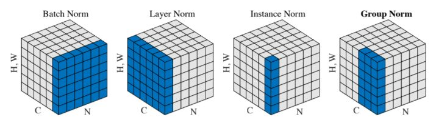
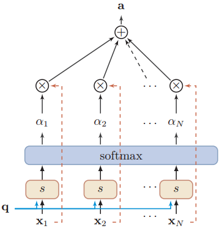
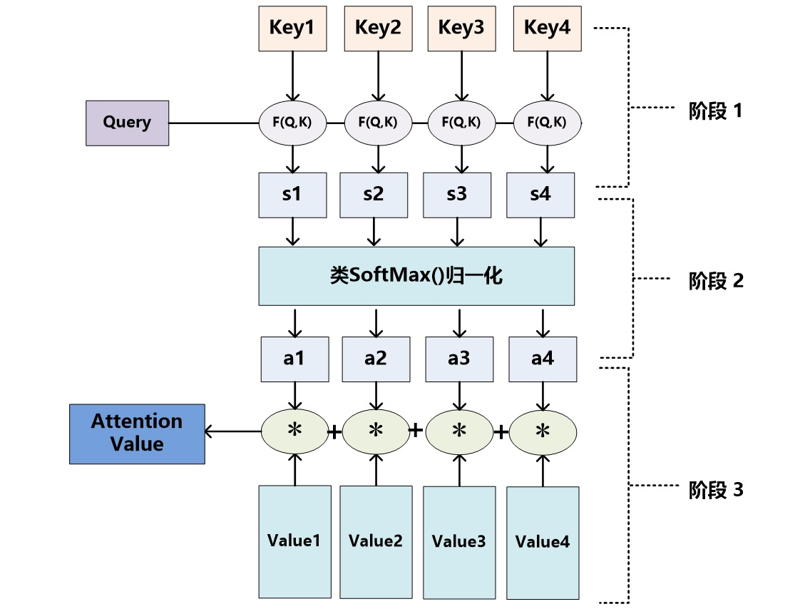
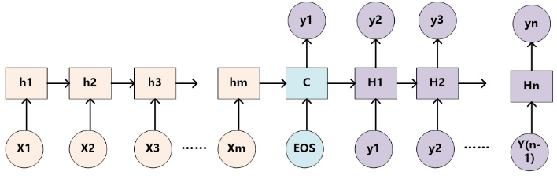
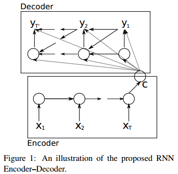
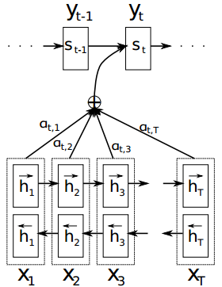
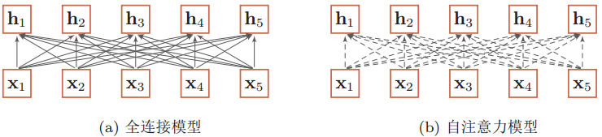
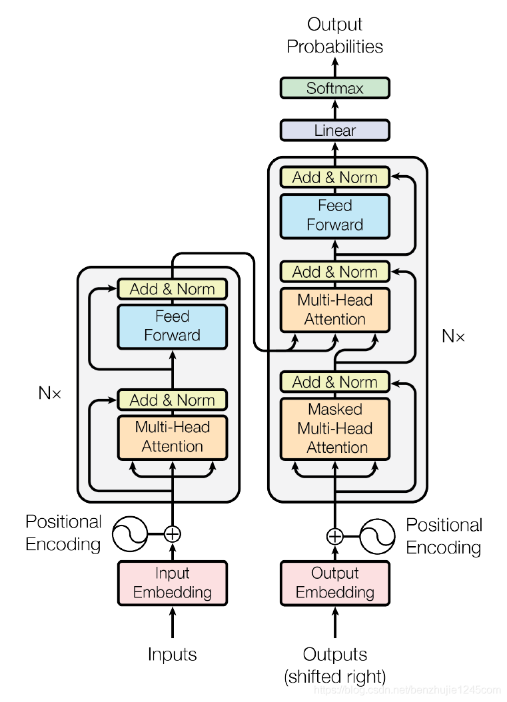

# 深度学习
## 1. 技巧
### 1. 降维
### 2. 正则化
    1. 正则化的目的
        * 防止过拟合（处理方法一般有正则化、减少维度pca）
    2. 正则化思路
        * 在loss上增加一个参数的平方项
        * 正则化参数要做的就是控制两个目标之间的平衡关系：在最小化训练误差的同时正则化参数使模型简单。
            1.最小化误差是为了更好的拟合训练数据。
            2.正则化参数是为了防止模型过分拟合训练数据。
    3. 正则化方法
        * L0范数
    所以正则化参数要保证模型简单的基础上使模型具有很好的泛化性能。
    https://blog.csdn.net/speargod/article/details/80233619
### 3. 归一化
  

* 目的
    * 分布在神经网络中，对上一层输出的激活值做归一化（normalize），这样做的好处是可以在一定程度上避免梯度消失问题。
* 分类及介绍  
    * LN(layer norm)
        BN是纵向归一化，同一层的每一个神经元具有各自的均值和方差。而LN是横向归一化，同一层的每个神经元具有相同的均值和方差，而不同的输入样本具有不同的均值和方差。     
        LN用于RNN效果比较明显，而用在CNN上效果不如BN。
    * BN(batch norm)  
        Batch Normalization的目的在于，让神经网络在训练的过程中使每一层的神经网络的输入保持相同的分布。
    * IN(Instance Normalization)
        在图像风格化和GAN中，生成结果主要依赖于某一个图像样本，因而对整个batch进行归一化不适合于该任务。可以采用对每一个示例、每一个通道都进行归一化，这就是Instance Normalization。可以认为IN是BN对每个样本进行归一化的修正。 
    * GN(Group Normalization)
        当batch size较小时，BN的效果较差。而GN的思想在于，归一化操作应当不依赖于batch size的大小。其基本做法为，将每个输入样本沿着通道进行分组，在每个组内部进行归一化。LN和IN也可以看作是GB的特殊情况，LN是分组数group=1时候的GN，IN是分组数group=C时候的GN。 
        https://www.jianshu.com/p/b6ab2128cea6
        https://zhuanlan.zhihu.com/p/137995496
### 3. 迁移学习
### 4. 知识蒸馏
* 目标： Hinton的文章"Distilling the Knowledge in a Neural Network"首次提出了知识蒸馏（暗知识提取）的概念，通过引入与教师网络（Teacher network：复杂、但预测精度优越）相关的软目标（Soft-target）作为Total loss的一部分，以诱导学生网络（Student network：精简、低复杂度，更适合推理部署）的训练，实现知识迁移（Knowledge transfer）。
    

* 流程（基于分类器模型）：
    * 基于同一个训练集，Teacher网络和Student网络的输入输出保持一致（如果不一致就需要想办法将其变得一致，比如加个linear layer）,假设输出维度为n，采用One-hot表示。
    * 一组数据同时流入Tnet（Teacher net） 和 Snet（Student net），在分类器到达分类器时一般会有两个操作，一个是Softmax和CrossEntropy计算损失操作。这时引入一个参数T（Temperature）$T \in[1,\infty)$，表示温度（类比蒸馏操作时的温度），和参数$\alpha$和$\beta$。
    * Softmax操作本来函数为：
        $$ q_i = \frac{exp(z_i)}{\sum_{j = 1}^{n} exp(z_j)}$$
        ，现在对每个$z_i$都做一个放缩变换，那么Softmax函数变为：
        $$q_i = \frac{exp(z_i / T)}{\sum_{j = 1}^{n} exp(z_j / T)}
        $$
        此时与原来的Softmax函数相比，$q_i$的分布会变得相对平缓。
    * 对Tnet的软Softmax结果与Snet的软Softmax结果做交叉熵，对Snet的Softmax结果和标签做交叉熵，前一个叫做软损失（softloss），后者叫做硬损失（hardloss），最终的Totalloss为两者的加权和。公式如下： 
    $$L_{soft} = CrossEntripy \left(softmax\left(\frac{logit_{Teacher}}{T}\right), softmax\left(\frac{logit_{Student}}{T}\right)  \right)$$
    $$L_{hard} = CrossEntripy \left(softmax\left(logit_{Student}\right), Label \right)$$
    $$L_{Total} = \alpha L_{soft} + \beta L_{hard}$$
    * 一般$\beta$比$\alpha$更小才会有最好的结果。$L_{soft}$ 一般应该乘上$\frac{1}{T^2}$,这样就能保证参数情况下的软硬损失贡献基本不变。在训练前期一般令$\alpha$的值偏大，这样更好的诱导Snet识别简单的样本。后期需要令$\beta$更大，这样才能保证Snet对困难样本有更好的辨识度。

* 原文链接：https://blog.csdn.net/nature553863/article/details/80568658
### 3. dropout
## 2. 文本方面
## 3. 图像方面
## 4. 注意力机制
* 注意力机制的作用
    * 一般而言，神经网络的参数越多，则模型表达能力越强，模型所储存的信息量也越大，这会带来信息过载的问题。
    * 在计算能力有限的情况下，将计算资源分配给更重要的任务，解决信息超载问题的一种资源分配方案。
    * 引入注意力机制后，在众多信息中聚焦于对当前任务更为关键的信息，降低或过滤对其他无关信息的关注度，就可以解决信息过载的问题，并提高任务处理的效率和准确性。
    * 类似于扫描全局，多头抓取当前头所关注的重点。快速筛选出高价值的信息。
* 注意力机制的数学原理  

    例如输入一个信息X， $X = [x_1,x_2,x_3,\dots,x_N]$。注意力机制的目的是，让神经网络不要同时处理这N个数据，而是有倾向的从X中选择一些与任务相关的信息，再处理计算。  

    根据从X选择信息的方式，分为两种
    * 软注意力机制（Soft Attention）
        * 不从X中选取1个或几个，而是计算N个或几个的信息加权，再输入到神经网络中进行计算。
    * 硬注意力机制
        * 只从X中选择1个多几个直接输入到下一层神经网络进行计算。  

    通常来讲，我们选取软注意力机制来处理神经网络的问题。  
* 注意力机制的计算一般分为两步：

    * 在所有输入信息上计算注意力分布
    * 根据注意力分布来计算输入信息的加权平均  

    1. 计算注意力分布  
        把输入信息向量X看做是一个信息存储器，现在给定一个查询向量q，用来查找并选择X中的某些信息，那么就需要知道被选择信息的索引位置。采取“软性”选择机制，不是从存储的多个信息中只挑出一条信息来，而是雨露均沾，从所有的信息中都抽取一些，只不过最相关的信息抽取得就多一些。  
        假设给定q，X，我们定义一个注意力变量$z \in [1,N]$来表示被选择信息的索引位置。之后计算选择信息i的概率：
        $$\begin{aligned}
        \alpha_i &= p(z = i | X, q) \\ 
        &=softmax \left( s( x_i ,q) \right)\\
        &= \frac{exp(s( x_i ,q))}{\sum_{j=1}^{N} (exp(s( x_j ,q)))}
        \end{aligned}$$  
        其中$\alpha_i$构成的向量被称为注意力分布（Attention Distribution）。其中的$s(x_i,q)$是注意力打分函数，一般有如下形式：
        $$
        \begin{array}{ll}
        加性模型 & & & s(x_i,q) =v^T · tanh(W*x_i + U*q)\\
        点积模型 & & & s(x_i,q) =x_i^T * q \\
        缩放点积模型 & & & s(x_i,q) = \frac{x_i^T * q}{\sqrt{d}} \\
        双线性模型 & & & s(x_i,q) = x_i^T* W * q 
        \end{array}
        $$
        其中W，U，v是可以学习参数，d是$x_i$的维度。
    2. 加权平均
    
        刚刚计算了X中的每个$x_i$与查询向量q的相关程度，也就是$\alpha_i$的分布。采用软性信息选择机制就是采用加权平均的方式对输入信息进行汇总，得到Attention的值：
        $$Attention (X,q) = \sum_{i=1}^{N} \alpha_i \cdot x_i$$
        
* 键值对注意力模式

    更一般的可以用键值对（key-value pair）来表示输入信息。  
    也就是$(K,V) = [(k_1,v_1), (k_2,v_2),\dots,(k_N,v_N)]$,其中键值K一般用于计算注意力分布$\alpha_i$, 值V一般用于计算加权求和的Attention值。当提出不同的Query的时候，可以根据Query与Key的得分注意力分布情况对V加权求和，得到针对于Query的注意力值。  
    * 这一过程非常类似于软寻址：  
    把输入信息X看做是存储器中存储的内容，元素由地址Key（键）和值Value组成，当前有个Key=Query的查询，目标是取出存储器中对应的Value值，即Attention值。而在软寻址中，并非需要硬性满足Key=Query的条件来取出存储信息，而是通过计算Query与存储器内元素的地址Key的相似度来决定，从对应的元素Value中取出多少内容。每个地址Key对应的Value值都会被抽取内容出来，然后求和，这就相当于由Query与Key的相似性来计算每个Value值的权重，然后对Value值进行加权求和。加权求和得到最终的Value值，也就是Attention值。
    * 实际的计算过程可以如下描述：
        1. 根据Query和Key计算二者相似度。依旧基于上述的打分函数或者自由设计。
        $$s_i = F(Q,k_i)$$
        2. 用Softmax函数对注意力得分进行数值转换。好处有两个，一方面进行了归一化，另一方面Softmax函数会突出重要元素（分数高的项）的权重。
        $$\alpha_i = Softmax(s_i) = \left( \frac{exp(s_i)}{\sum_{j=1}^{N}exp(s_j)} \right)$$
        3. 根据权重系数对Vaule进行加权求和。
        $$Attention((K,V), Q) = \sum_{i =1}^{N} \alpha_i v_i$$
    * 图示如下：
    
    * 这里有个刚学的时候比较疑惑的地方。
        * 问题一：Q，K，V在一开始的输入例子$X = (x_1,x_2,\dots,x_N), x_i \in R^{d_1}$中，分别是什么？  
          答： 注意力机制分两种，一个是自注意力机制，一种是非自注意力机制。
            * 自注意力机制就是输入X内部的注意力机制，不涉及外来输入的Query。类似于自问自答，它的好处是可以建立序列内长距离的依赖关系，它的实现一般有这么几部分：  
                1. 计算Q，K，V：  
                其中(K,V)对是由X得来的，但是X内部的项经历了不同的系数矩阵。Q实则也是由X来的，也经历了跟以上两个不同的系数矩阵，而这三个系数矩阵都是可学习参数。
                $$\begin{array}{ll}
                K = W_K * X \in R^{d_3 * N}\\
                V = W_V * X \in R^{d_2 * N}\\
                Q = W_Q * X \in R^{d_3 * N}
                \end{array}
                $$
                这样就得到了查询向量序列Q,键向量序列K，值向量序列V。而$W_Q,W_K,W_V$是可以学习的参数矩阵。  
                
                2. 那么对应于查询序列Q中的$q_i$的输出注意力值就应该这么算：
                $$\begin{aligned}
                h_i &= attention\left( (K,V),q_i \right)\\
                &= \sum_{j=1}^{N} \alpha_i \cdot v_i\\
                &= \sum_{j=1}^{N} softmax\left( s(k_j,q_i) \right) \cdot v_j
                \end{aligned}
                $$

                3. 自注意力机制可以当作一层来用也可以代替卷积或者循环层，也可以与其他层交替使用。除此之外也可以做多头注意力函数，分别令自注意力机制注意序列不同的位置。
            * 非自注意力机制使用最多的在Transformer的Decoder层，以及Encode-Decode早先的异步序列到序列模型。
                * 首先介绍不引入Attention的Seq2Seq网络：
                
                简要介绍其好处，可以处理长度不固定的输入，也可以输出长度不固定的序列，而且输入和输出的长度都可以不同。  
                借用《Learning phrase representations using RNN encoder-decoder for statistical machine translation》这篇论文，它提出了一种RNN Encoder-Decoder的结构，如下图。除外之外，这篇文章的牛逼之处在于首次提出了GRU(Gated Recurrent Unit)这个常用的LSTM变体结构。  
                  
                其正向传播过程如下：
                    1. 将X的元素逐个输入到Encoder的RNN网络中，计算隐状态$h_t$,整合所有的隐状态计算最终的语义表示向量$c$。
                    2. Decoder的网络每一时刻都会通过语义表示向量$c$、上一时刻隐状态$s_{t-1}$、上一时刻预测值$y_{t-1}$计算当前时刻的隐状态$s_t$。
                    3.  由语义表示向量$c$、当前时刻隐状态$s_{t}$、上一时刻预测值$y_{t-1}$计算当前时刻的输出$y_t$。  

                    也就是说，在生成目标句子的每一个值时，使用的语义表示向量都是同一个$c$值。这也就表示着，对于任何一个预测值$y_t$，任何输入的单词对他的重要性都一致，也就意味着注意力分散了。

                * 引入自注意力机制的Encoder-Decoder模型  
                  《Neural Machine Translation by Jointly Learning to Align and Translate 》这篇论文在上面那篇论文的基础上，提出了一种新的神经网络翻译模型（NMT）结构，也就是在RNN Encoder-Decoder框架中加入了注意力机制。这篇论文中的编码器是一个双向GRU，解码器也是用RNN网络来生成句子。  
                    
                  这个模型的正向传播和上一个模型类似，但在Decoder计算时有很大差别。最主要的区别就在于固定不变的语义表示向量$c$被替换成了$c_1,c_2,\dots,c_N$。也就是这一部分引入了注意力机制。  
                  计算过程为：
                    1. 输入源语言的一个句子X,长度为N，计算每个状态的隐状态$h_t$，这一步和之前类似，但网络改成了GRU网络。
                    2. 求此时Encoder的语义表示向量$c_t$，这里用到了Decoder的前一时刻隐状态$s_{t-1}$、Encoder的每一个隐状态$h_j$，其实也就是$Q = s_{t-1}$,$K =V = (h_0,h_1,\dots,h_{N})$。
                      $$
                      \begin{array}{ll}
                      e_{tj} = Score(s_{t-1}, h_j)\\
                      \alpha_{tj} = Softmax(e_{tj}) = \frac{exp(e_{tj})}{\sum_{k=1}^{N}exp(e_{tk})}\\
                      c_t = \sum_{j=1}^{N} \alpha_{tj} \cdot h_{j}
                      \end{array}$$  
                    
                    3. 依据此时Encoder的语义表示向量$c_t$，前一时刻的输出$y_{t-1}$、解码器前一时刻隐状态$s_{t-1}$计算当前时刻隐状态$s_t$。
                    4. 依据此时Encoder的语义表示向量$c_t$，前一时刻的输出$y_{t-1}$、解码器当前时刻隐状态$s_{t}$计算当前时刻输出$y_t$。
                * 关于自注意力机制的解释。
                
                前面说了自注意力模型可以建立序列内部的长距离依赖关系，其实通过全连接神经网络也可以做到，但是问题在于全连接网络的连接边数是固定不变的，因而无法处理长度可变的序列。而自注意力模型可以动态生成不同连接的权重，那么生成多少个权重，权重的大小是多少，都是可变的，当输入更长的序列时，只需要生成更多连接边即可。如上图，虚线连接边是动态变化的。

## 5. Tansformer解析
1. 模型
    

    https://blog.csdn.net/benzhujie1245com/article/details/117173090
## 6. Bert相关问题
1. Bert的预训练任务都有哪些，有什么用途？  
    * 预测被遮挡的单词(MLM:Masked Language Model)
    bert的MLM是对于输入文本，随机选取15%的token对其进行操作，操作的方法：80%替换程MASK，10%保持不变，10%替换成其他词。  
    目的：bert进行MLM是为了获得输入句子的上下文与被mask词的语义关系，但是为了适应下游任务（下游任务没有MASK符号）且获得该词本身的语义信息，选择80%MASK, 10%保持不变。同时为了防止模型偷懒记住这些MASK词本身的信息，引入10%的替换，这样模型就必须通过双向语义信息去推断预测词
    * NSP(next sentence prediction)  
    bert的第二个任务是预测输入的两个句子是否为连续，这是考虑到下游任务中存在任务需要对两个句子进行建模，因此bert引入了这个任务，并不是必须的。
    原文链接：https://blog.csdn.net/weixin_42145837/article/details/124156635
    https://blog.csdn.net/KK_1657654189/article/details/122204640
2. Bert的网络层都有哪些？
    * 编码端是由相同的编码层堆叠而成，每个编码层包括：
        * 多头注意力机制
        * 残差链接
        * layer norm
        * Linear layer
        * layer norm
        * 激活函数一般为Relu函数
    * base bert 由6个堆叠而成。
    * large bert 由12个堆叠而成，参数量上亿。
    * 输出维度一般为768维。
3. Bert一般都有哪些任务？
    * 预训练任务由MLM（多分类任务）、NSP（二分类）任务。
    * 下游任务可以用于：
        * 情感分析
        * 词性标注
        * 蕴含任务：输入两个语句，输出蕴含关系类别。
        * 抽取式问答系统。（没做过）

## 7. 马尔可夫链相关

1.  

##  

