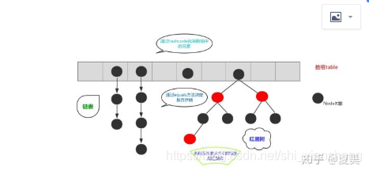
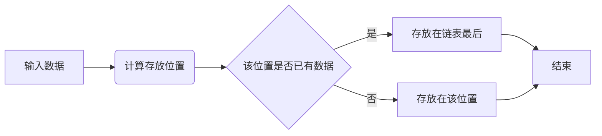

# 研发类

## 1. 编程问题
* 1.重载与覆盖的区别？
    * 答：1、方法的覆盖是子类和父类之间的关系，是垂直关系；方法的重载是同一个类中方法之间的关系，是水平关系  
    2、覆盖只能由一个方法，或只能由一对方法产生关系；方法的重载是多个方法之间的关系。  
    3、覆盖要求参数列表相同；重载要求参数列表不同。  
    4、覆盖关系中，调用那个方法体，是根据对象的类型（对像对应存储空间类型）来决定；重载关系，是根据调 用时的实参表与形参表来选择方法体的。
* 2.hashmap解释一下
  
    * 结构如下图：  
        
      他是一个列表（散列表） + 链表（+红黑树）的一个数据结构。  
    

    * 优点  
        * 顺序表（列表）: 随机读取，时间复杂度低，但是插入删除效率低，空间复杂度高，内存占用大，大小固定不易扩展。
        * 链表：看用内存宽松，不依赖连续内存，空间复杂度小，插入删除效率高，没有固定大小，扩展灵活。缺点是不能随机查找，需要遍历。
        * 哈希表（散列表）：速度非常快，是列表+链表的结合结构。主结构是长度可以变化的顺序表，每个顺序表的节点可以引出一个单独的链表。

* Python的实例方法、静态方法以及类方法的区别。

  * 实例方法：

    一般借助于self关键字来绑定此类的实例。是python的默认函数方法，函数体内可以使用类属性（但需要self关键字）也可以使用实例属性。需要使用类实例来调用。

  * 类方法

    要在方法前增加修饰符$@classmethod$来修饰，函数最少需要一个参数，于self相似，一般默认为cls，cls会将此方法与类本身绑定，因此只可以使用类属性而不可使用实例属性。调用时一般使用类名直接调用。【类的实例也可以调用，但不推荐】

  * 静态方法：

    要在方法前增加修饰符$@staticmethod$来修饰。与实例方法以及类方法不同的是，其不需要关键字self与cls等，也就是这个函数不会与这个类进行绑定也不会与类的实例绑定，故而不可调用任何类属性以及实例属性。它与普通方法的区别就是将自身的命名空间放到了类的命名空间下。调用时，可以用类名，也可以用类实例。

    ```python
    class ex(object):
        aLL = 0 #类属性
        def __init__(self):
            self.a = 0
            ex.aLL += 1
    
        
        def add_1(self): #实例方法
            self.a = self.aLL
            self.aLL += 1
        
        @classmethod
        def show_a(cls): #类方法
            print('类方法调用：',cls.aLL)
            
        @staticmethod
        def show_1(a = 1): #静态方法
            print('类内静态方法调用',a)
    
    if __name__ == '__main__':
        Ex = ex()
        ex.show_a()
        Ex.show_a()
        ex.show_1()
        print(Ex.a)
        Ex.show_1()
    '''
    类方法调用： 1
    类方法调用： 1
    类内静态方法调用 1
    0
    类内静态方法调用 1
    '''
    ```

    


## 2. 操作系统问题

## 3. 网络问题
## 4. 数据库问题
* 谈谈MySQL的事务隔离级别
	* 答：隔离性描述的是一个事务所做的修改何时对其它事务可见。
    MySQL数据库有四种隔离级别。
    未提交读：事务可以读取到其它事务未提交的数据。在这个隔离级别下会导致脏读。
    提交读：也叫不可重复读，事务所做的修改只有在提交过后才能对其它事务可见。在这个隔离级别下会出现幻读。幻读是指一个事务中连续执行相同的查询，得到的结果集可能不一致（其他事务对数据进行了操作），对比两次的结果集，数据就好像是凭空出现亦或凭空消失。
    可重复读：一个事务中连续执行相同的查询，查询的结果集总是一致的。在这个隔离级别下事务读取到的是当前事务开启前的数据版本。MySQL通过MVCC版本控制机制和一致性锁定读（自动加上Next-Key Locking，锁定查询的记录和一定的范围）解决了幻读问题。
    串行化：InnoDB存储引擎自动为每个select语句加上共享锁。使MySQL读写操作之间串行执行，从而避免了脏读和幻读的，但是数据库也就无法并发读写了。
* 这四种隔离级别的实现机制如下：

	* READ UNCOMMITTED & READ COMMITTED：
		通过Record Lock算法实现了行锁，但READ UNCOMMITTED允许读取未提交数据，所以存在脏读问题。而READ COMMITTED允许读取提交数据，所以不存在脏读问题，但存在不可重复读问题。
	* REPEATABLE READ：
		使用Next-Key Lock算法实现了行锁，并且不允许读取已提交的数据，所以解决了不可重复读的问题。另外，该算法包含了间隙锁，会锁定一个范围，因此也解决了幻读的问题。
	* SERIALIZABLE：
		对每个SELECT语句后自动加上LOCK IN SHARE MODE，即为每个读取操作加一个共享锁。因此在这个事务隔离级别下，读占用了锁，对一致性的非锁定读不再予以支持。