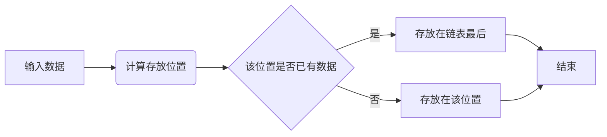

# 
 研发或算法面经 

## 研发类

### 1. 编程问题
* 1.重载与覆盖的区别？
    * 答：1、方法的覆盖是子类和父类之间的关系，是垂直关系；方法的重载是同一个类中方法之间的关系，是水平关系  
    2、覆盖只能由一个方法，或只能由一对方法产生关系；方法的重载是多个方法之间的关系。  
    3、覆盖要求参数列表相同；重载要求参数列表不同。  
    4、覆盖关系中，调用那个方法体，是根据对象的类型（对像对应存储空间类型）来决定；重载关系，是根据调 用时的实参表与形参表来选择方法体的。
* 2.hashmap解释一下
  
    * 结构如下图：  
        
      他是一个列表（散列表） + 链表（+红黑树）的一个数据结构。  
    

### 2. 操作系统问题

### 3. 网络问题
### 4. 数据库问题
* 谈谈MySQL的事务隔离级别
	* 答：隔离性描述的是一个事务所做的修改何时对其它事务可见。
    MySQL数据库有四种隔离级别。
    未提交读：事务可以读取到其它事务未提交的数据。在这个隔离级别下会导致脏读。
    提交读：也叫不可重复读，事务所做的修改只有在提交过后才能对其它事务可见。在这个隔离级别下会出现幻读。幻读是指一个事务中连续执行相同的查询，得到的结果集可能不一致（其他事务对数据进行了操作），对比两次的结果集，数据就好像是凭空出现亦或凭空消失。
    可重复读：一个事务中连续执行相同的查询，查询的结果集总是一致的。在这个隔离级别下事务读取到的是当前事务开启前的数据版本。MySQL通过MVCC版本控制机制和一致性锁定读（自动加上Next-Key Locking，锁定查询的记录和一定的范围）解决了幻读问题。
    串行化：InnoDB存储引擎自动为每个select语句加上共享锁。使MySQL读写操作之间串行执行，从而避免了脏读和幻读的，但是数据库也就无法并发读写了。
* 这四种隔离级别的实现机制如下：

	* READ UNCOMMITTED & READ COMMITTED：
		通过Record Lock算法实现了行锁，但READ UNCOMMITTED允许读取未提交数据，所以存在脏读问题。而READ COMMITTED允许读取提交数据，所以不存在脏读问题，但存在不可重复读问题。
	* REPEATABLE READ：
		使用Next-Key Lock算法实现了行锁，并且不允许读取已提交的数据，所以解决了不可重复读的问题。另外，该算法包含了间隙锁，会锁定一个范围，因此也解决了幻读的问题。
	* SERIALIZABLE：
		对每个SELECT语句后自动加上LOCK IN SHARE MODE，即为每个读取操作加一个共享锁。因此在这个事务隔离级别下，读占用了锁，对一致性的非锁定读不再予以支持。

## 算法类
### 1. 数据结构  
主要存放一些数据结构的解释以及实现，包括排序算法、栈、队列、堆、树等。
### 2. 技巧  
主要存放一些leetcode中常出现的技巧，包括二分法、多指针、滑动窗口、中心扩散、（状态压缩）动态规划、深度优先搜索（dfs）、广度优先搜索（bfs）等。
### 3. 机器学习  
   主要存放一些经典机器学习模型，总结其原理、使用场景、常用考点，比如svm，k-means,马尔科夫链，逻辑回归，朴素贝叶斯，普聚类等。 
#### 1. 回归模型
#### 2. 分类模型
#### 2. 聚类模型
#### 3. 集成模型 
#### 5. 常见问题

### 4. 深度学习
#### 1. 技巧
##### 1. 降维
##### 2. 正则化
##### 3. dropout
#### 2. 文本方面
#### 3. 图像方面