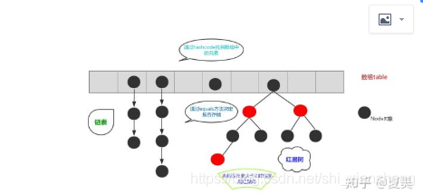
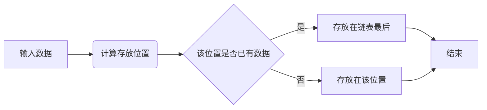
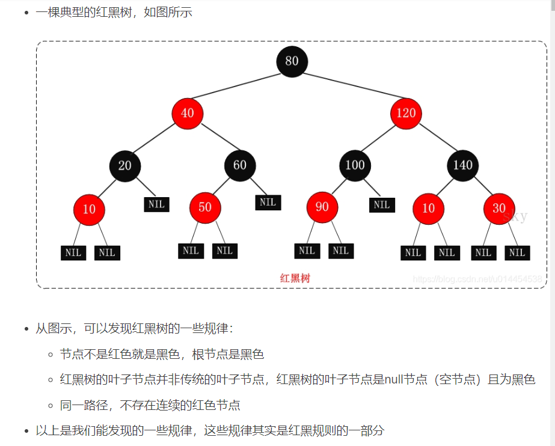

# 
 研发或算法面经 

## 研发类

### 1. 编程问题
* 1.重载与覆盖的区别？
    * 答：1、方法的覆盖是子类和父类之间的关系，是垂直关系；方法的重载是同一个类中方法之间的关系，是水平关系  
    2、覆盖只能由一个方法，或只能由一对方法产生关系；方法的重载是多个方法之间的关系。  
    3、覆盖要求参数列表相同；重载要求参数列表不同。  
    4、覆盖关系中，调用那个方法体，是根据对象的类型（对像对应存储空间类型）来决定；重载关系，是根据调 用时的实参表与形参表来选择方法体的。
* 2.hashmap解释一下
  
    * 结构如下图：  
        
      他是一个列表（散列表） + 链表（+红黑树）的一个数据结构。  
    

    * 优点  
        * 顺序表（列表）: 随机读取，时间复杂度低，但是插入删除效率低，空间复杂度高，内存占用大，大小固定不易扩展。
        * 链表：看用内存宽松，不依赖连续内存，空间复杂度小，插入删除效率高，没有固定大小，扩展灵活。缺点是不能随机查找，需要遍历。
        * 哈希表（散列表）：速度非常快，是列表+链表的结合结构。主结构是长度可以变化的顺序表，每个顺序表的节点可以引出一个单独的链表。

### 2. 操作系统问题

### 3. 网络问题
### 4. 数据库问题
* 谈谈MySQL的事务隔离级别
	* 答：隔离性描述的是一个事务所做的修改何时对其它事务可见。
    MySQL数据库有四种隔离级别。
    未提交读：事务可以读取到其它事务未提交的数据。在这个隔离级别下会导致脏读。
    提交读：也叫不可重复读，事务所做的修改只有在提交过后才能对其它事务可见。在这个隔离级别下会出现幻读。幻读是指一个事务中连续执行相同的查询，得到的结果集可能不一致（其他事务对数据进行了操作），对比两次的结果集，数据就好像是凭空出现亦或凭空消失。
    可重复读：一个事务中连续执行相同的查询，查询的结果集总是一致的。在这个隔离级别下事务读取到的是当前事务开启前的数据版本。MySQL通过MVCC版本控制机制和一致性锁定读（自动加上Next-Key Locking，锁定查询的记录和一定的范围）解决了幻读问题。
    串行化：InnoDB存储引擎自动为每个select语句加上共享锁。使MySQL读写操作之间串行执行，从而避免了脏读和幻读的，但是数据库也就无法并发读写了。
* 这四种隔离级别的实现机制如下：

	* READ UNCOMMITTED & READ COMMITTED：
		通过Record Lock算法实现了行锁，但READ UNCOMMITTED允许读取未提交数据，所以存在脏读问题。而READ COMMITTED允许读取提交数据，所以不存在脏读问题，但存在不可重复读问题。
	* REPEATABLE READ：
		使用Next-Key Lock算法实现了行锁，并且不允许读取已提交的数据，所以解决了不可重复读的问题。另外，该算法包含了间隙锁，会锁定一个范围，因此也解决了幻读的问题。
	* SERIALIZABLE：
		对每个SELECT语句后自动加上LOCK IN SHARE MODE，即为每个读取操作加一个共享锁。因此在这个事务隔离级别下，读占用了锁，对一致性的非锁定读不再予以支持。

## 算法类
### 1. 数据结构  
主要存放一些数据结构的解释以及实现，包括排序算法、栈、队列、堆、树等。
1. 红黑树的重要知识点
    
	* 从二叉搜索树 → AVL，严格控制左右子树高度差，避免二叉搜索树退化成链表（时间复杂度从$O(log_2 N )$退化成$O(N)$)。
    * 从AVL $\rightarrow$红黑树，牺牲严格的平衡要求，以换取新增/删除节点时少量的旋转操作，平均性能优于AVL；通过红黑规则，保证在最坏的情况下，也能拥有$O ( log_2 N )$ 的时间复杂度。
    * 红黑树的应用：Java的TreeMap、TreeSet、HashMap(JDK1.8)；linux底层的CFS进程调度算法中，vruntime使用红黑树进行存储；多路复用技术的Epoll，其核心结构是红黑树 + 双向链表。
    * 红黑规则： 
        1. 节点不是黑色，就是红色（非黑即红）
        2.  根节点为黑色
        3.  叶节点为黑色（叶节点是指末梢的空节点 Nil或Null）
        4. 一个节点为红色，则其两个子节点必须是黑色的（根到叶子的所有路径，不可能存在两个连续的红色节点）
        5. 每个节点到叶子节点的所有路径，都包含相同数目的黑色节点（相同的黑色高度）
        > * 一些说明：  
        > 1. 约束4和5，保证了红黑树的大致平衡：根到叶子的所有路径中，最长路径不会超过最短路径的2倍。使得红黑树在最坏的情况下，也能有$O(log_2 N)$的查找效率。
        > 2. 关于叶子节点：Java实现中，null代表空节点，无法看到黑色的空节点，反而能看到传统的红色叶子节点。
        > 3. 关于叶子节点：Java实现中，null代表空节点，无法看到黑色的空节点，反而能看到传统的红色叶子节点。 

    原文链接：https://blog.csdn.net/u014454538/article/details/120120216
    
    

### 2. 技巧  
主要存放一些leetcode中常出现的技巧，包括二分法、多指针、滑动窗口、中心扩散、（状态压缩）动态规划、深度优先搜索（dfs）、广度优先搜索（bfs）等。
### 3. 机器学习  
   主要存放一些经典机器学习模型，总结其原理、使用场景、常用考点，比如svm，k-means,马尔科夫链，逻辑回归，朴素贝叶斯，普聚类等。 
#### 1. 回归模型

#### 2. 分类模型
#### 2. 聚类模型
#### 3. 集成模型 
#### 5. 常见问题

### 4. 深度学习
#### 1. 技巧
##### 1. 降维
##### 2. 正则化
##### 3. 迁移学习
##### 4. 知识蒸馏
* 目标： Hinton的文章"Distilling the Knowledge in a Neural Network"首次提出了知识蒸馏（暗知识提取）的概念，通过引入与教师网络（Teacher network：复杂、但预测精度优越）相关的软目标（Soft-target）作为Total loss的一部分，以诱导学生网络（Student network：精简、低复杂度，更适合推理部署）的训练，实现知识迁移（Knowledge transfer）。
* 流程（基于分类器模型）：
    * 基于同一个训练集，Teacher网络和Student网络的输入输出保持一致（如果不一致就需要想办法将其变得一致，比如加个linear layer）,假设输出维度为n，采用One-hot表示。
    * 一组数据同时流入Tnet（Teacher net） 和 Snet（Student net），在分类器到达分类器时一般会有两个操作，一个是Softmax和CrossEntropy计算损失操作。这时引入一个参数T（Temperature）$T \in[1,\infty)$，表示温度（类比蒸馏操作时的温度），和参数$\alpha$和$\beta$。
    * Softmax操作本来函数为：
        $$ q_i = \frac{exp(z_i)}{\sum_{j = 1}^{n} exp(z_j)}$$
        ，现在对每个$z_i$都做一个放缩变换，那么Softmax函数变为：
        $$q_i = \frac{exp(z_i / T)}{\sum_{j = 1}^{n} exp(z_j / T)}
        $$
        此时与原来的Softmax函数相比，$q_i$的分布会变得相对平缓。
    * 对Tnet的软Softmax结果与Snet的软Softmax结果做交叉熵，对Snet的Softmax结果和标签做交叉熵，前一个叫做软损失（softloss），后者叫做硬损失（hardloss），最终的Totalloss为两者的加权和。公式如下： 
    $$L_{soft} = CrossEntripy \left(softmax\left(\frac{logit_{Teacher}}{T}\right), softmax\left(\frac{logit_{Student}}{T}\right)  \right)$$
    $$L_{hard} = CrossEntripy \left(softmax\left(logit_{Student}\right), Label \right)$$
    $$L_{Total} = \alpha L_{soft} + \beta L_{hard}$$
    * 一般$\beta$比$\alpha$更小才会有最好的结果。$L_{soft}$ 一般应该乘上$\frac{1}{T^2}$,这样就能保证参数情况下的软硬损失贡献基本不变。在训练前期一般令$\alpha$的值偏大，这样更好的诱导Snet识别简单的样本。后期需要令$\beta$更大，这样才能保证Snet对困难样本有更好的辨识度。

* 原文链接：https://blog.csdn.net/nature553863/article/details/80568658
##### 3. dropout
#### 2. 文本方面
#### 3. 图像方面
#### 4. 注意力机制